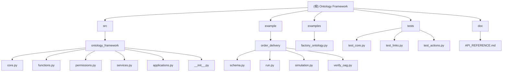

# Ontology Framework - 架构分析报告

## 项目概述

Ontology Framework 是一个基于 Python 的语义本体框架，灵感来源于 Palantir Foundry。该框架提供了一套完整的 API 来定义和管理业务实体、关系和操作，支持复杂的业务逻辑建模。

## 核心架构

### 技术栈
- **语言**: Python 3.12+
- **构建工具**: Hatchling
- **测试框架**: pytest
- **包管理**: pyproject.toml

### 核心组件

#### 1. 本体核心 (`src/ontology_framework/core.py`)
- **Ontology**: 主入口类，管理整个本体定义
- **ObjectType**: 实体类型定义，支持属性、派生属性、权限控制
- **LinkType**: 实体间关系定义
- **ActionType**: 事务操作定义
- **ObjectInstance**: 实体实例
- **ObjectSet**: 实体集合，支持查询和过滤
- **PropertyType**: 属性类型枚举

#### 2. 函数系统 (`src/ontology_framework/functions.py`)
- **@ontology_function**: 函数注册装饰器
- **FunctionRegistry**: 函数注册表
- 支持业务逻辑封装、计算、本体编辑
- 支持副作用操作（通过 ActionContext）

#### 3. 权限管理 (`src/ontology_framework/permissions.py`)
- **AccessControlList**: 访问控制列表
- **Principal**: 用户/组主体定义
- **PermissionType**: 权限类型（VIEW, EDIT, DELETE, OWNER）

#### 4. 服务层 (`src/ontology_framework/services.py`)
- **ObjectSetService**: 对象集合服务，模拟 Object Storage V2
- 支持对象索引、权限检查、语义搜索

#### 5. 应用层 (`src/ontology_framework/applications.py`)
- **ObjectView**: 对象视图定义
- **ObjectExplorer**: 对象浏览器
- **Quiver**: 数据分析组件

## 模块结构图

## 功能模块分析

### ✅ 已实现的核心功能

1. **本体定义与管理**
   - 对象类型注册和管理
   - 链接类型定义和验证
   - 操作类型注册

2. **属性系统**
   - 基础属性类型（STRING, INTEGER, BOOLEAN, DATE, TIMESTAMP）
   - 派生属性（backed by functions）
   - 动态属性访问

3. **函数系统**
   - 装饰器式函数注册
   - 类型安全的函数调用
   - 支持本体编辑的副作用操作

4. **查询与导航**
   - 对象集合过滤
   - 关系导航（search_around）
   - 基础语义搜索

5. **权限控制**
   - ACL 权限系统
   - 主体和权限类型定义
   - 视图级权限检查

### 📊 项目规模统计

- **总文件数**: ~20个 Python 文件（排除虚拟环境）
- **核心框架文件**: 6个
- **示例文件**: 5个
- **测试文件**: 3个
- **文档文件**: 2个

## 测试覆盖率分析

### ✅ 已有测试
- 对象类型注册测试
- 链接类型注册和验证测试
- 操作类型注册测试

### ⚠️ 测试缺口
- 函数系统测试
- 权限管理测试
- 服务层测试
- 应用层测试
- 集成测试

## 文档完整性

### ✅ 已有文档
- **README.md**: 基础使用说明，包含安装和入门示例
- **API_REFERENCE.md**: 详细的 API 参考文档

### ⚠️ 文档缺口
- 架构设计文档
- 开发者指南
- 部署指南
- 最佳实践指南

## 代码质量评估

### ✅ 优势
1. **清晰的架构设计**: 分层明确，职责分离
2. **类型安全**: 广泛使用 dataclass 和类型注解
3. **可扩展性**: 插件式的函数和权限系统
4. **测试友好**: 架构支持单元测试

### ⚠️ 改进空间
1. **错误处理**: 需要更完善的异常处理机制
2. **日志系统**: 缺少结构化日志
3. **性能优化**: 查询性能有待提升
4. **数据持久化**: 目前基于内存，需要真实存储层

## 示例项目分析

### 订单配送示例 (`example/order_delivery/`)
- **完整的业务模型**: 包含订单、商家、骑手等实体
- **复杂的关系定义**: 支持状态流转和时间追踪
- **派生属性演示**: 实际计算时长和时间差

### 工厂本体示例 (`examples/factory_ontology.py`)
- **权限控制演示**: ACL 的实际应用
- **多组件集成**: 展示完整的框架使用流程
- **数据可视化**: ObjectView 和 Quiver 的使用示例

## 实施建议和优先级

### 🔥 高优先级（立即实施）

1. **完善测试覆盖**
   - 添加函数系统测试
   - 补充权限管理测试
   - 增加集成测试

2. **错误处理增强**
   - 实现统一的异常类层次
   - 添加详细的错误消息
   - 提供错误恢复机制

3. **性能优化**
   - 实现真正的索引系统
   - 优化查询性能
   - 添加缓存机制

### 📈 中优先级（近期实施）

1. **数据持久化**
   - 支持数据库后端
   - 实现数据迁移机制
   - 添加数据验证

2. **开发工具完善**
   - CLI 工具
   - 开发服务器
   - 调试支持

3. **监控和日志**
   - 结构化日志系统
   - 性能监控
   - 健康检查

### 🔮 低优先级（长期规划）

1. **高级功能**
   - 实时更新
   - 分布式支持
   - 图形界面

2. **生态系统**
   - 插件系统
   - 第三方集成
   - 社区工具

## 结论

Ontology Framework 是一个设计良好、架构清晰的本体管理框架。项目已具备核心功能，拥有实用的示例和基础的文档。当前的主要任务是完善测试覆盖、增强错误处理，以及提升性能。

项目展现了良好的可扩展性和实用性，适合作为企业级数据建模和业务逻辑管理的基础框架。通过按照建议的优先级进行改进，可以将其发展成为一个成熟稳定的开源项目。

## 变更记录 (Changelog)

- **2025-11-24**: 初始架构分析完成
  - 完成项目结构扫描和核心模块分析
  - 识别出测试覆盖缺口和改进机会
  - 制定分阶段实施建议