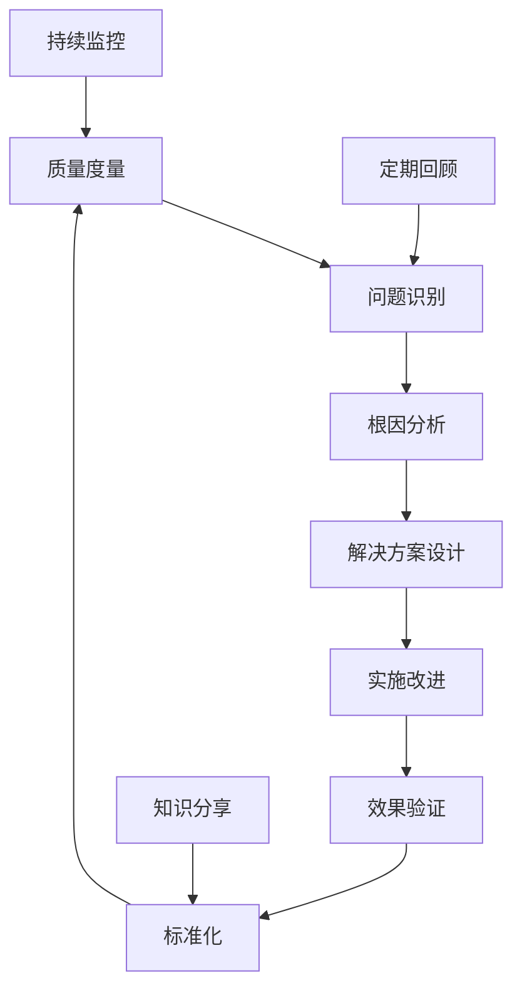

# Ontology Framework 质量保证与验证流程

## 📋 质量保证体系概述

本文档定义了 Ontology Framework 项目的完整质量保证（QA）和验证流程，确保代码质量、系统可靠性和用户体验的持续改进。

## 🎯 质量目标

### 核心质量指标

| 指标类别 | 当前值 | 目标值 | 测量方法 |
|---------|--------|--------|----------|
| **测试覆盖率** | 30% | 80%+ | Coverage.py |
| **代码质量分** | 7.5/10 | 9.0/10 | SonarQube |
| **性能基准** | 基准线 | 2x提升 | 基准测试 |
| **安全漏洞** | 0 critical | 0 critical | 安全扫描 |
| **文档完整性** | 70% | 95% | 文档覆盖检查 |

### 质量维度定义

#### 1. 功能正确性
- **定义**: 系统功能符合需求规格说明的程度
- **度量指标**: 功能测试通过率、缺陷密度
- **验收标准**: 100%功能测试通过，缺陷密度 < 1/KLOC

#### 2. 性能效率
- **定义**: 系统在规定条件下的性能表现
- **度量指标**: 响应时间、吞吐量、资源利用率
- **验收标准**: 响应时间 < 100ms，吞吐量 > 1000 ops/s

#### 3. 可靠性
- **定义**: 系统在规定时间内无故障运行的能力
- **度量指标**: MTBF（平均无故障时间）、可用性
- **验收标准**: MTBF > 720小时，可用性 > 99.9%

#### 4. 安全性
- **定义**: 系统保护信息和数据的能力
- **度量指标**: 安全漏洞数量、权限控制正确性
- **验收标准**: 0严重漏洞，100%权限测试通过

#### 5. 可维护性
- **定义**: 系统被修改的难易程度
- **度量指标**: 圈复杂度、代码重复率、文档覆盖率
- **验收标准**: 圈复杂度 < 10，重复率 < 5%

## 🔍 质量保证流程

### 阶段1: 开发阶段质量保证

#### 1.1 编码规范

**静态代码分析工具链**:
```yaml
# .pre-commit-config.yaml
repos:
  - repo: https://github.com/psf/black
    rev: 22.3.0
    hooks:
      - id: black
        language_version: python3.11

  - repo: https://github.com/pycqa/isort
    rev: 5.10.1
    hooks:
      - id: isort

  - repo: https://github.com/pycqa/flake8
    rev: 4.0.1
    hooks:
      - id: flake8
        args: [--max-line-length=88, --max-complexity=10]

  - repo: https://github.com/pre-commit/mirrors-mypy
    rev: v0.950
    hooks:
      - id: mypy
        additional_dependencies: [types-all]
```

**代码质量检查清单**:
- [ ] 代码格式化（Black）
- [ ] 导入排序（isort）
- [ ] 代码风格检查（flake8）
- [ ] 类型注解检查（mypy）
- [ ] 安全性扫描（bandit）
- [ ] 依赖漏洞检查（safety）

#### 1.2 单元测试

**测试编写标准**:
```python
# tests/test_example.py
import pytest
from unittest.mock import Mock, patch
from ontology_framework.core import Ontology

class TestOntology:
    """本体管理系统测试套件"""

    @pytest.fixture
    def ontology(self):
        """测试夹具：创建本体实例"""
        return Ontology()

    def test_register_object_type_success(self, ontology):
        """测试：成功注册对象类型"""
        # Given - 准备测试数据
        object_type = ObjectType("User", "用户对象")

        # When - 执行操作
        result = ontology.register_object_type(object_type)

        # Then - 验证结果
        assert result is True
        assert "User" in ontology.object_types

    @pytest.mark.parametrize("invalid_name", ["", None, 123])
    def test_register_object_type_invalid(self, ontology, invalid_name):
        """测试：无效对象类型注册"""
        with pytest.raises(ValueError):
            ontology.register_object_type(ObjectType(invalid_name, "测试"))

    def test_performance_object_creation(self, ontology):
        """性能测试：对象创建"""
        import time

        start_time = time.time()
        for i in range(1000):
            ontology.create_object("User", {"id": i})
        end_time = time.time()

        # 性能断言：1000个对象创建应在1秒内完成
        assert (end_time - start_time) < 1.0
```

**测试覆盖率要求**:
- 核心模块覆盖率 ≥ 90%
- 工具模块覆盖率 ≥ 80%
- 示例代码覆盖率 ≥ 70%
- 整体覆盖率 ≥ 80%

#### 1.3 代码审查

**Pull Request 模板**:
```markdown
## 变更描述
简要描述本次变更的内容和目的

## 变更类型
- [ ] 新功能
- [ ] 功能改进
- [ ] Bug修复
- [ ] 性能优化
- [ ] 文档更新
- [ ] 重构

## 测试
- [ ] 单元测试已添加/更新
- [ ] 集成测试已通过
- [ ] 手动测试已完成
- [ ] 性能测试已验证

## 质量检查
- [ ] 代码格式化（Black）
- [ ] 类型检查（MyPy）
- [ ] 静态分析（Flake8）
- [ ] 安全扫描（Bandit）

## 部署影响
- [ ] 数据库迁移
- [ ] 配置变更
- [ ] 环境依赖
- [ ] 向后兼容性

## 审查重点
请审查人员特别关注以下方面：
1.
2.
3.
```

**代码审查检查清单**:
- [ ] 功能实现正确性
- [ ] 代码可读性和维护性
- [ ] 测试覆盖充分性
- [ ] 性能影响评估
- [ ] 安全性考虑
- [ ] 文档完整性

### 阶段2: 集成测试阶段

#### 2.1 集成测试策略

**测试层次结构**:
```
集成测试
├── 模块间集成测试
│   ├── Core ↔ Functions
│   ├── Core ↔ Permissions
│   └── Services ↔ Core
├── 系统集成测试
│   ├── 端到端业务流程
│   ├── 数据一致性验证
│   └── 错误处理测试
└── 环境集成测试
    ├── 多环境兼容性
    ├── 依赖集成测试
    └── 部署验证测试
```

**集成测试实现示例**:
```python
# tests/integration/test_workflows.py
import pytest
from ontology_framework.core import Ontology
from ontology_framework.functions import ontology_function

class TestOrderDeliveryWorkflow:
    """订单配送工作流集成测试"""

    @pytest.fixture
    def setup_ontology(self):
        """设置完整的订单配送本体"""
        ontology = Ontology()

        # 注册对象类型
        ontology.register_object_type(create_order_type())
        ontology.register_object_type(create_user_type())
        ontology.register_object_type(create_merchant_type())

        # 注册链接类型
        ontology.register_link_type(create_order_user_link())

        # 注册函数
        ontology.register_function(calculate_delivery_time)

        return ontology

    def test_complete_order_workflow(self, setup_ontology):
        """测试完整的订单处理工作流"""
        ontology = setup_ontology

        # 1. 创建用户
        user = ontology.create_object("User", {
            "user_id": "user001",
            "name": "张三"
        })

        # 2. 创建订单
        order = ontology.create_object("Order", {
            "order_id": "order001",
            "user_id": "user001",
            "status": "pending"
        })

        # 3. 建立关联
        ontology.create_link("belongs_to", order, user)

        # 4. 执行业务逻辑
        delivery_time = ontology.execute_function(
            "calculate_delivery_time",
            order_id="order001"
        )

        # 5. 验证结果
        assert delivery_time > 0
        assert order.get("status") == "processing"
```

#### 2.2 性能集成测试

**负载测试场景**:
```python
# tests/performance/test_load.py
import pytest
import asyncio
import aiohttp
from concurrent.futures import ThreadPoolExecutor

class TestLoadScenarios:
    """负载测试场景"""

    def test_concurrent_object_creation(self, ontology):
        """并发对象创建测试"""
        def create_object_batch(batch_id):
            """创建一批对象"""
            objects = []
            for i in range(100):
                obj = ontology.create_object("Product", {
                    "product_id": f"prod_{batch_id}_{i}",
                    "name": f"产品 {i}"
                })
                objects.append(obj)
            return objects

        # 并发创建10批，每批100个对象
        with ThreadPoolExecutor(max_workers=10) as executor:
            futures = [
                executor.submit(create_object_batch, i)
                for i in range(10)
            ]
            results = [future.result() for future in futures]

        # 验证所有对象创建成功
        total_objects = sum(len(batch) for batch in results)
        assert total_objects == 1000

    @pytest.mark.asyncio
    async def test_async_query_performance(self, ontology):
        """异步查询性能测试"""
        # 准备测试数据
        for i in range(1000):
            ontology.create_object("Order", {
                "order_id": f"order_{i}",
                "status": ["pending", "processing", "completed"][i % 3]
            })

        # 并发查询测试
        async def query_orders(status):
            """查询指定状态的订单"""
            return ontology.get_objects_of_type("Order").filter("status", status)

        # 并发执行多个查询
        tasks = [
            query_orders("pending"),
            query_orders("processing"),
            query_orders("completed")
        ]

        start_time = time.time()
        results = await asyncio.gather(*tasks)
        end_time = time.time()

        # 性能验证：并发查询应在500ms内完成
        assert (end_time - start_time) < 0.5
        assert all(len(result) > 300 for result in results)
```

### 阶段3: 系统验证阶段

#### 3.1 用户验收测试（UAT）

**UAT测试用例设计**:
```python
# tests/uat/test_user_scenarios.py
import pytest
from ontology_framework.applications import OntologyBrowser

class TestUserScenarios:
    """用户场景测试"""

    def test_business_user_workflow(self):
        """业务用户完整工作流测试"""
        # 场景：订单管理员处理一天的工作

        # 1. 登录系统
        browser = OntologyBrowser()
        browser.login("order_manager", "password")

        # 2. 查看待处理订单
        pending_orders = browser.query_orders(status="pending")
        assert len(pending_orders) > 0

        # 3. 处理订单分配
        for order in pending_orders[:10]:  # 处理前10个订单
            order.assign_rider("rider_001")
            order.update_status("assigned")
            browser.save_object(order)

        # 4. 验证分配结果
        assigned_orders = browser.query_orders(status="assigned")
        assert len(assigned_orders) >= 10

        # 5. 生成日报
        daily_report = browser.generate_daily_report()
        assert "processed_orders" in daily_report
        assert daily_report["processed_orders"] >= 10

    def test_developer_api_usage(self):
        """开发者API使用测试"""
        from ontology_framework import Ontology

        # 开发者使用API进行数据建模和查询

        # 1. 定义领域模型
        ontology = Ontology()
        ontology.register_object_type(create_product_model())

        # 2. 创建数据
        products = [
            ontology.create_object("Product", {
                "sku": f"SKU_{i}",
                "name": f"产品 {i}",
                "price": 100 + i
            })
            for i in range(100)
        ]

        # 3. 复杂查询
        expensive_products = ontology.get_objects_of_type("Product") \
                                .filter("price", ">", 150) \
                                .order_by("price", "desc") \
                                .limit(10)

        # 4. 验证查询结果
        assert len(expensive_products) == 10
        assert all(p.get("price") > 150 for p in expensive_products)
        assert expensive_products[0].get("price") >= expensive_products[1].get("price")
```

#### 3.2 安全性验证

**安全性测试用例**:
```python
# tests/security/test_permissions.py
import pytest
from ontology_framework.permissions import PermissionManager

class TestSecurityValidation:
    """安全性验证测试"""

    def test_access_control(self, ontology):
        """访问控制测试"""
        # 设置权限
        pm = PermissionManager(ontology)
        pm.create_role("order_manager")
        pm.grant_permission("order_manager", "Order", ["read", "update"])

        # 测试用户权限
        user = ontology.create_user("manager001", ["order_manager"])

        # 权限验证
        assert pm.check_permission(user, "Order", "read")
        assert pm.check_permission(user, "Order", "update")
        assert not pm.check_permission(user, "User", "delete")

    def test_input_validation(self, ontology):
        """输入验证测试"""
        # SQL注入防护测试
        malicious_input = "'; DROP TABLE Orders; --"

        with pytest.raises(ValidationError):
            ontology.create_object("Order", {
                "order_id": malicious_input,
                "status": "pending"
            })

        # XSS防护测试
        xss_input = "<script>alert('XSS')</script>"

        with pytest.raises(ValidationError):
            ontology.create_object("Product", {
                "name": xss_input,
                "description": "测试产品"
            })

    def test_data_encryption(self, ontology):
        """数据加密测试"""
        # 敏感数据加密存储
        sensitive_data = {
            "user_id": "user001",
            "credit_card": "4111-1111-1111-1111"
        }

        # 创建加密对象
        encrypted_user = ontology.create_encrypted_object("User", sensitive_data)

        # 验证数据已加密
        stored_data = ontology._storage.get(encrypted_user.id)
        assert "4111-1111-1111-1111" not in str(stored_data)

        # 验证解密功能正常
        decrypted_data = encrypted_user.get_decrypted_data()
        assert decrypted_data["credit_card"] == "4111-1111-1111-1111"
```

## 📊 质量度量与监控

### 质量指标仪表板

```python
# quality_dashboard.py
import streamlit as st
import plotly.express as px
from datetime import datetime, timedelta

class QualityDashboard:
    """质量指标仪表板"""

    def __init__(self):
        self.metrics_collector = MetricsCollector()

    def render_dashboard(self):
        """渲染质量仪表板"""
        st.title("Ontology Framework 质量仪表板")

        # 关键指标卡片
        col1, col2, col3, col4 = st.columns(4)

        with col1:
            self.render_metric_card(
                "测试覆盖率",
                f"{self.get_test_coverage():.1f}%",
                "📊"
            )

        with col2:
            self.render_metric_card(
                "代码质量分",
                f"{self.get_code_quality():.1f}/10",
                "✅"
            )

        with col3:
            self.render_metric_card(
                "性能评分",
                f"{self.get_performance_score():.0f}",
                "⚡"
            )

        with col4:
            self.render_metric_card(
                "安全漏洞",
                f"{self.get_security_vulnerabilities()}",
                "🔒"
            )

        # 趋势图表
        self.render_trend_charts()

        # 详细指标
        self.render_detailed_metrics()

    def render_metric_card(self, title, value, icon):
        """渲染指标卡片"""
        st.metric(title, value, delta=None, delta_color="normal")

    def render_trend_charts(self):
        """渲染趋势图表"""
        # 获取历史数据
        dates = self.get_dates_range(30)  # 最近30天
        coverage_data = [self.get_test_coverage(date) for date in dates]
        quality_data = [self.get_code_quality(date) for date in dates]

        # 测试覆盖率趋势
        fig_coverage = px.line(
            x=dates,
            y=coverage_data,
            title="测试覆盖率趋势",
            labels={"x": "日期", "y": "覆盖率 (%)"}
        )
        st.plotly_chart(fig_coverage, use_container_width=True)

        # 代码质量趋势
        fig_quality = px.line(
            x=dates,
            y=quality_data,
            title="代码质量趋势",
            labels={"x": "日期", "y": "质量分数"}
        )
        st.plotly_chart(fig_quality, use_container_width=True)
```

### 自动化质量报告

```python
# quality_reporter.py
import smtplib
from email.mime.text import MimeText
from jinja2 import Template

class QualityReporter:
    """质量报告生成器"""

    def __init__(self):
        self.metrics_collector = MetricsCollector()

    def generate_weekly_report(self):
        """生成周质量报告"""
        metrics = self.collect_quality_metrics()

        # 使用模板生成报告
        report_template = Template("""
        # Ontology Framework 质量周报

        ## 📊 本周质量概览

        ### 关键指标
        - **测试覆盖率**: {{ metrics.coverage }}%
          📈📉
        - **代码质量分**: {{ metrics.quality_score }}/10
          📈📉
        - **性能评分**: {{ metrics.performance_score }}/100
        - **安全漏洞**: {{ metrics.security_vulnerabilities }}个

        ### 本周改进
        
        - ✅ {{ improvement }}
        

        ### 需要关注
        
        - ⚠️ {{ issue }}
        

        ## 📈 详细数据

        ### 测试覆盖率详情
        
        - {{ module.name }}: {{ module.coverage }}%
        

        ### 性能基准
        
        - {{ benchmark.name }}: {{ benchmark.time }}ms
        
        """)

        report_content = report_template.render(metrics=metrics)
        return report_content

    def send_report(self, recipients):
        """发送质量报告"""
        report = self.generate_weekly_report()

        msg = MimeText(report)
        msg['Subject'] = "Ontology Framework 质量周报"
        msg['From'] = "quality-system@company.com"
        msg['To'] = ", ".join(recipients)

        # 发送邮件
        with smtplib.SMTP('smtp.company.com') as server:
            server.send_message(msg)
```

## 🔄 持续改进流程

### 质量回顾会议

**每周质量回顾模板**:
```markdown
# 第X周质量回顾会议

## 📊 质量指标回顾

### 本周表现
- 测试覆盖率: XX% (目标: 80%)
- 代码质量分: X.X/10 (目标: 9.0)
- 性能评分: XX/100 (目标: 90)
- Bug数量: XX个 (目标: <5)

### 趋势分析
- 📈 改进指标
- 📉 下降指标
- ➡️ 稳定指标

## 🔍 问题分析

### 发现的问题
1. **问题描述**: 具体问题现象
   - **影响范围**: 受影响的模块/功能
   - **根本原因**: 问题产生的根本原因
   - **解决方案**: 建议的解决方案
   - **负责人**: 问题处理负责人
   - **截止时间**: 解决时间目标

### 改进机会
1. **改进建议**: 具体改进建议
   - **预期收益**: 改进带来的收益
   - **实施难度**: 实施的难度评估
   - **优先级**: 改进的优先级

## 📋 下周行动计划

### 质量改进任务
- [ ] 任务1: 具体任务描述 (负责人, 截止时间)
- [ ] 任务2: 具体任务描述 (负责人, 截止时间)
- [ ] 任务3: 具体任务描述 (负责人, 截止时间)

### 质量目标
- 测试覆盖率目标: XX%
- 代码质量分目标: X.X
- 性能改进目标: 具体目标

## 🎯 长期质量规划

### 月度目标
- 目标1: 具体月度质量目标
- 目标2: 具体月度质量目标

### 季度目标
- 目标1: 具体季度质量目标
- 目标2: 具体季度质量目标
```

### 质量改进循环



## 📋 质量检查清单

### 代码提交前检查
- [ ] 代码格式化（Black）
- [ ] 导入排序（isort）
- [ ] 类型注解完整（MyPy）
- [ ] 静态分析通过（Flake8）
- [ ] 安全扫描通过（Bandit）
- [ ] 单元测试添加/更新
- [ ] 测试覆盖率不下降
- [ ] 文档更新（如需要）

### Pull Request检查
- [ ] PR描述完整清晰
- [ ] 变更类型正确标记
- [ ] 测试通过（本地+CI）
- [ ] 代码审查完成
- [ ] 性能影响评估
- [ ] 安全性考虑
- [ ] 向后兼容性检查

### 发布前检查
- [ ] 所有测试通过
- [ ] 性能基准达标
- [ ] 安全扫描通过
- [ ] 文档完整性检查
- [ ] 部署脚本验证
- [ ] 回滚方案准备
- [ ] 监控告警配置

## 🎯 质量保证成熟度评估

### 成熟度等级定义

#### Level 1: 初始级 (Initial)
- **特征**: 质量活动混乱，无规范流程
- **表现**: 质量不可预测，依赖个人能力
- **改进重点**: 建立基础质量规范

#### Level 2: 已管理级 (Managed)
- **特征**: 基本质量流程，项目管理化
- **表现**: 质量基本可控，可重复
- **改进重点**: 流程标准化和自动化

#### Level 3: 已定义级 (Defined)
- **特征**: 标准质量流程，文档化
- **表现**: 质量稳定一致，可预测
- **改进重点**: 度量数据驱动改进

#### Level 4: 量化管理级 (Quantitatively Managed)
- **特征**: 度量驱动，统计控制
- **表现**: 质量可量化，持续优化
- **改进重点**: 预测性质量管理

#### Level 5: 优化级 (Optimizing)
- **特征**: 持续改进，创新驱动
- **表现**: 质量领先，行业最佳实践
- **改进重点**: 创新质量管理方法

### 当前成熟度评估

**项目当前状态**: Level 2.5 - 已管理级向已定义级过渡

**优势**:
- ✅ 基础质量流程已建立
- ✅ 自动化测试框架已搭建
- ✅ CI/CD基础流程已实现
- ✅ 代码规范工具已配置

**改进方向**:
- 🔄 完善质量度量体系
- 🔄 加强流程标准化
- 🔄 提升自动化覆盖率
- 🔄 建立质量数据驱动文化

**提升路径**:
1. **短期目标 (3个月)**: 达到Level 3 - 已定义级
2. **中期目标 (6个月)**: 达到Level 4 - 量化管理级
3. **长期目标 (12个月)**: 达到Level 5 - 优化级

---

本质量保证与验证流程文档将根据项目发展和实施经验持续更新，确保质量体系的持续改进和优化。