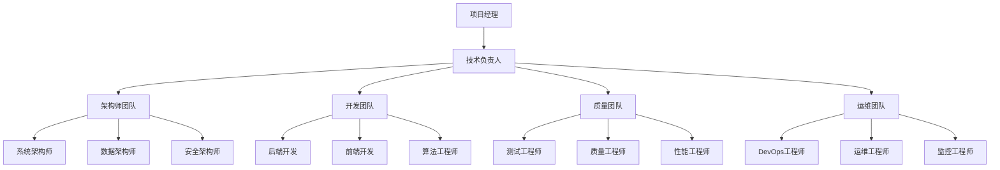
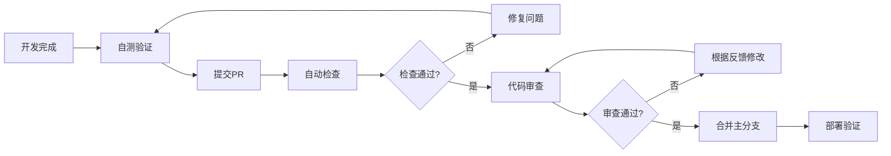
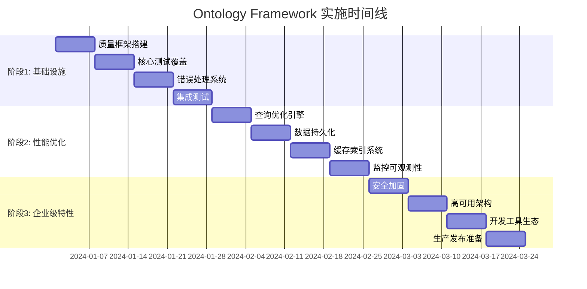

# Ontology Framework 系统化工作流执行计划

## 📋 执行摘要

### 项目愿景
将 Ontology Framework 发展成为一个**生产就绪、企业级**的本体管理和业务建模平台，支持复杂业务场景的建模、分析和自动化。

### 核心价值主张
- **简化复杂性**: 通过本体建模简化复杂业务逻辑
- **提升效率**: 自动化业务流程和数据分析
- **确保质量**: 企业级的可靠性和安全性
- **支持扩展**: 灵活的架构支持业务增长

### 项目当前状态
- **架构成熟度**: Level 2.5/5 (已管理级 → 已定义级)
- **测试覆盖率**: 30% → 目标80%+
- **代码质量**: 7.5/10 → 目标9.0/10
- **功能完整性**: 核心功能完成，需要工程化加固

## 🎯 总体实施策略

### 战略框架

```
Ontology Framework 成熟度提升路径

Level 1 → Level 2 → Level 3 → Level 4 → Level 5
   ↑           ↑           ↑           ↑           ↑
 初始级    已管理级    已定义级   量化管理级    优化级
(现在)      (短期)      (中期)      (长期)      (愿景)
```

### 三阶段实施模型

#### 🏗️ 阶段1: 基础设施加固 (Weeks 1-4)
**目标**: 建立坚实的工程基础
- 测试覆盖率提升到80%+
- 统一错误处理机制
- 基础性能优化
- CI/CD流程建立

#### ⚡ 阶段2: 性能与扩展性 (Weeks 5-8)
**目标**: 实现生产级性能和扩展性
- 高级查询优化
- 数据持久化层
- 缓存和索引系统
- 监控和可观测性

#### 🚀 阶段3: 企业级特性 (Weeks 9-12)
**目标**: 支持大规模企业应用
- 高可用和容错
- 安全加固
- 开发工具生态
- 完整文档和培训

## 📊 详细实施计划

### 阶段1: 基础设施加固 (Weeks 1-4)

#### Week 1: 质量基础设施
**负责人**: 质量工程师 + DevOps工程师
**关键任务**:
```yaml
任务分解:
  - [ ] 测试框架搭建 (pytest + coverage + benchmark)
  - [ ] 代码质量工具配置 (black, mypy, flake8, bandit)
  - [ ] CI/CD管道初始化
  - [ ] 开发环境标准化

交付物:
  - 完整的开发环境配置
  - 自动化质量检查流程
  - 基础测试框架

质量门控:
  - 所有新代码必须通过质量检查
  - 测试覆盖率不能下降
  - CI/CD管道稳定运行
```

#### Week 2: 核心模块测试
**负责人**: 测试工程师 + 开发团队
**关键任务**:
```yaml
任务分解:
  - [ ] 核心模块单元测试 (core.py, functions.py)
  - [ ] 权限系统测试 (permissions.py)
  - [ ] 服务层测试 (services.py)
  - [ ] 边缘条件和异常测试

覆盖目标:
  - core.py: 90%+
  - functions.py: 85%+
  - permissions.py: 85%+
  - services.py: 80%+

交付物:
  - 完整的单元测试套件
  - 测试覆盖率报告
  - 性能基准测试
```

#### Week 3: 错误处理与日志
**负责人**: 系统架构师 + 后端工程师
**关键任务**:
```yaml
任务分解:
  - [ ] 统一异常类层次设计
  - [ ] 结构化日志系统实现
  - [ ] 错误恢复机制
  - [ ] 调试工具完善

技术方案:
  - 使用Python logging模块
  - 集成structlog进行结构化日志
  - 实现重试和熔断机制
  - 添加详细的错误上下文

交付物:
  - 异常处理框架
  - 日志配置和最佳实践
  - 错误处理文档
```

#### Week 4: 集成测试与性能基准
**负责人**: 测试工程师 + 性能工程师
**关键任务**:
```yaml
任务分解:
  - [ ] 模块间集成测试
  - [ ] 端到端工作流测试
  - [ ] 性能基准建立
  - [ ] 负载测试场景设计

测试场景:
  - 订单配送完整流程
  - 工厂管理业务流程
  - 大规模数据处理
  - 并发访问场景

交付物:
  - 集成测试套件
  - 性能基准数据
  - 负载测试报告
```

### 阶段2: 性能与扩展性 (Weeks 5-8)

#### Week 5: 查询优化引擎
**负责人**: 性能工程师 + 算法工程师
**关键任务**:
```yaml
任务分解:
  - [ ] 查询性能分析
  - [ ] 索引系统设计
  - [ ] 查询优化器实现
  - [ ] 缓存策略制定

技术重点:
  - B-Tree索引实现
  - 查询计划优化
  - 智能缓存策略
  - 内存池管理

性能目标:
  - 查询响应时间 < 10ms
  - 支持100K+对象
  - 并发查询 > 1000 QPS
```

#### Week 6: 数据持久化层
**负责人**: 数据工程师 + 后端架构师
**关键任务**:
```yaml
任务分解:
  - [ ] 数据库抽象层设计
  - [ ] PostgreSQL适配器实现
  - [ ] 数据迁移系统
  - [ ] 事务管理

技术方案:
  - SQLAlchemy ORM集成
  - 支持多种数据库后端
  - 数据版本控制
  - 批量操作优化

扩展性:
  - 水平分片支持
  - 读写分离
  - 连接池管理
```

#### Week 7: 缓存与索引系统
**负责人**: 性能工程师 + 系统架构师
**关键任务**:
```yaml
任务分解:
  - [ ] 多级缓存架构
  - [ ] Redis集成
  - [ ] 智能索引选择
  - [ ] 缓存失效策略

缓存层次:
  - L1: 内存缓存 (LRU)
  - L2: Redis缓存
  - L3: 数据库查询缓存

索引策略:
  - 自适应索引创建
  - 复合索引优化
  - 索引使用统计
```

#### Week 8: 监控与可观测性
**负责人**: DevOps工程师 + 系统架构师
**关键任务**:
```yaml
任务分解:
  - [ ] 性能监控系统
  - [ ] 健康检查端点
  - [ ] 告警规则配置
  - [ ] 运维仪表板

监控指标:
  - 应用性能指标 (APM)
  - 业务指标监控
  - 系统资源监控
  - 错误率和延迟

工具栈:
  - Prometheus + Grafana
  - OpenTelemetry
  - ELK Stack
```

### 阶段3: 企业级特性 (Weeks 9-12)

#### Week 9: 安全加固
**负责人**: 安全工程师 + 后端工程师
**关键任务**:
```yaml
安全加固:
  - [ ] 认证授权系统
  - [ ] 数据加密实现
  - [ ] 安全审计日志
  - [ ] 漏洞扫描和修复

安全标准:
  - OWASP Top 10防护
  - 数据隐私保护
  - 访问控制细化
  - 安全编码规范
```

#### Week 10: 高可用架构
**负责人**: 系统架构师 + DevOps工程师
**关键任务**:
```yaml
高可用设计:
  - [ ] 服务容错机制
  - [ ] 自动故障恢复
  - [ ] 负载均衡
  - [ ] 灾难恢复

可用性目标:
  - 系统可用性 > 99.9%
  - RTO < 1小时
  - RPO < 15分钟
  - 自动故障检测 < 30秒
```

#### Week 11: 开发工具生态
**负责人**: 开发者体验工程师 + 技术文档工程师
**关键任务**:
```yaml
工具开发:
  - [ ] CLI工具完善
  - [ ] IDE插件开发
  - [ ] 代码生成器
  - [ ] 调试工具

文档体系:
  - [ ] API文档自动生成
  - [ ] 使用教程编写
  - [ ] 最佳实践指南
  - [ ] 视频教程制作
```

#### Week 12: 生产发布准备
**负责人**: 项目经理 + 全体团队
**关键任务**:
```yaml
发布准备:
  - [ ] 生产环境部署
  - [ ] 性能验证测试
  - [ ] 用户验收测试
  - [ ] 发布文档编写

验收标准:
  - 所有质量指标达标
  - 生产环境稳定运行
  - 用户反馈正面
  - 文档完整准确
```

## 👥 团队组织与协作

### 核心团队结构



### 角色职责矩阵

| 角色 | 测试 | 性能优化 | 安全 | 架构设计 | 开发 | 运维 |
|------|------|----------|------|----------|------|------|
| 项目经理 | ⭐ | ⭐ | ⭐ | ⭐ | ⭐ | ⭐ |
| 技术负责人 | ⭐⭐⭐ | ⭐⭐⭐ | ⭐⭐ | ⭐⭐⭐ | ⭐⭐⭐ | ⭐⭐ |
| 系统架构师 | ⭐⭐ | ⭐⭐⭐ | ⭐⭐ | ⭐⭐⭐ | ⭐⭐ | ⭐ |
| 开发工程师 | ⭐⭐⭐ | ⭐ | ⭐ | ⭐ | ⭐⭐⭐ | ⭐ |
| 测试工程师 | ⭐⭐⭐ | ⭐⭐ | ⭐ | ⭐ | ⭐⭐ | ⭐ |
| DevOps工程师 | ⭐⭐ | ⭐⭐ | ⭐⭐ | ⭐ | ⭐ | ⭐⭐⭐ |

### 协作工作流

#### 每日协作流程
```yaml
时间安排:
  09:00-09:15: 每日站会 (15分钟)
    - 昨天完成的工作
    - 今天计划的任务
    - 遇到的阻塞和问题

  09:15-12:00: 专注开发时间 (2小时45分钟)
    - 核心开发任务
    - 代码审查
    - 技术讨论

  13:30-17:00: 协作和集成时间 (3小时30分钟)
    - 集成测试
    - 问题解决
    - 知识分享
    - 文档更新

会议安排:
  周一: 周计划会议 (30分钟)
  周三: 技术评审会议 (60分钟)
  周五: 周总结会议 (30分钟)
```

#### 代码审查流程


## ⚠️ 风险管理与缓解

### 风险评估矩阵

| 风险类别 | 概率 | 影响 | 风险等级 | 缓解策略 |
|----------|------|------|----------|----------|
| 技术复杂性风险 | 中 | 高 | 🔴 高 | 技术调研、原型验证、专家咨询 |
| 性能目标风险 | 中 | 高 | 🔴 高 | 基准测试、性能监控、分阶段优化 |
| 团队资源风险 | 低 | 高 | 🟡 中 | 资源规划、技能培训、外部支持 |
| 质量标准风险 | 中 | 中 | 🟡 中 | 自动化测试、持续集成、质量门控 |
| 集成风险 | 中 | 中 | 🟡 中 | 接口设计、版本管理、向后兼容 |

### 关键风险缓解计划

#### 🔴 高风险: 技术复杂性
**风险描述**: 高性能查询优化和分布式架构实现复杂

**缓解策略**:
```yaml
技术调研阶段:
  - [ ] 现有解决方案调研
  - [ ] 技术选型评估
  - [ ] 概念验证开发
  - [ ] 性能基准测试

原型验证阶段:
  - [ ] 核心功能原型
  - [ ] 性能压力测试
  - [ ] 架构可行性验证
  - [ ] 技术风险评估

实施阶段:
  - [ ] 分阶段实施
  - [ ] 关键节点检查
  - [ ] 备选方案准备
  - [ ] 专家技术支持
```

#### 🔴 高风险: 性能目标
**风险描述**: 性能目标可能无法按期达成

**缓解策略**:
```yaml
性能监控:
  - 实时性能指标收集
  - 性能趋势分析
  - 瓶颈早期识别
  - 自动告警机制

优化策略:
  - 分层优化策略
  - 关键路径优化
  - 缓存策略实施
  - 算法优化

风险应对:
  - 性能目标调整
  - 技术方案调整
  - 资源投入增加
  - 时间计划调整
```

## 📈 成功标准与验收

### 量化成功指标

#### 技术指标
| 指标项 | 当前值 | 目标值 | 验收标准 |
|--------|--------|--------|----------|
| 测试覆盖率 | 30% | 80%+ | coverage.py报告 |
| 代码质量分 | 7.5/10 | 9.0/10 | SonarQube评分 |
| 查询性能 | 基准线 | 10x提升 | 基准测试对比 |
| 系统可用性 | 95% | 99.9% | 生产环境监控 |
| 安全漏洞 | 未知 | 0 critical | 安全扫描报告 |

#### 业务指标
| 指标项 | 当前值 | 目标值 | 验收标准 |
|--------|--------|--------|----------|
| 用户满意度 | 3.5/5 | 4.5/5 | 用户调研 |
| 功能完整性 | 70% | 95% | 功能检查清单 |
| 文档完整性 | 60% | 95% | 文档审计 |
| 学习曲线 | 陡峭 | 平缓 | 新用户上手时间 |
| 社区活跃度 | 低 | 中 | GitHub stars, issues |

### 验收检查清单

#### 功能验收
```markdown
## 核心功能验证

### 本体管理
- [ ] 对象类型定义和管理
- [ ] 链接类型定义和管理
- [ ] 属性类型支持
- [ ] 继承和多态支持

### 查询系统
- [ ] 基础查询功能
- [ ] 复杂条件查询
- [ ] 关系导航查询
- [ ] 聚合统计查询

### 函数系统
- [ ] 自定义函数注册
- [ ] 函数执行引擎
- [ ] 参数类型验证
- [ ] 返回值处理

### 权限管理
- [ ] 用户和角色管理
- [ ] 细粒度权限控制
- [ ] 访问控制验证
- [ ] 权限继承

### 性能优化
- [ ] 查询性能达标
- [ ] 索引系统工作正常
- [ ] 缓存机制有效
- [ ] 并发处理能力
```

#### 质量验收
```markdown
## 质量标准验证

### 测试质量
- [ ] 单元测试覆盖率 ≥ 80%
- [ ] 集成测试覆盖主要流程
- [ ] 性能测试建立基准
- [ ] 自动化测试流程完整

### 代码质量
- [ ] 代码风格一致性
- [ ] 复杂度控制达标
- [ ] 类型注解完整
- [ ] 文档字符串完整

### 安全性
- [ ] 无严重安全漏洞
- [ ] 输入验证完整
- [ ] 权限控制有效
- [ ] 数据保护到位

### 可维护性
- [ ] 模块职责清晰
- [ ] 接口设计合理
- [ ] 依赖关系简单
- [ ] 扩展性良好
```

#### 运维验收
```markdown
## 运维就绪验证

### 部署自动化
- [ ] CI/CD流程完整
- [ ] 自动化测试通过
- [ ] 部署脚本完善
- [ ] 回滚机制就绪

### 监控告警
- [ ] 关键指标监控
- [ ] 告警规则配置
- [ ] 运维仪表板
- [ ] 日志聚合分析

### 性能监控
- [ ] 应用性能监控
- [ ] 基础设施监控
- [ ] 业务指标监控
- [ ] 异常检测机制

### 容灾备份
- [ ] 数据备份策略
- [ ] 灾难恢复计划
- [ ] 高可用配置
- [ ] 故障转移测试
```

## 🔄 持续改进计划

### 短期改进 (1-3个月)
- **性能调优**: 基于生产数据持续优化
- **用户体验**: 收集用户反馈改进交互
- **文档完善**: 补充高级用法和最佳实践
- **工具扩展**: 增加更多开发工具

### 中期发展 (3-6个月)
- **功能扩展**: 支持更多业务场景
- **生态建设**: 第三方插件和集成
- **社区发展**: 开源社区建设
- **企业特性**: 更多企业级功能

### 长期愿景 (6-12个月)
- **智能化**: AI驱动的本体推荐
- **云原生**: 完全的云原生架构
- **国际化**: 多语言和多区域支持
- **标准化**: 行业标准和最佳实践

## 📞 项目支持与沟通

### 沟通渠道
```yaml
内部沟通:
  - 日常沟通: Slack/Teams
  - 技术讨论: GitHub Discussions
  - 文档协作: Confluence/Notion
  - 代码审查: GitHub Pull Requests

外部沟通:
  - 用户反馈: GitHub Issues
  - 社区交流: Discord/Slack
  - 官方发布: Blog/邮件
  - 技术分享: Conference/Meetup
```

### 支持体系
```yaml
技术支持:
  - 开发文档: 完整的API和概念文档
  - 教程指南: 从入门到高级的教程
  - 视频教程: 关键功能的视频演示
  - 在线咨询: 实时技术支持

培训支持:
  - 开发者培训: 系统使用和扩展培训
  - 管理员培训: 部署和运维培训
  - 用户培训: 业务使用培训
  - 认证考试: 官方认证体系
```

## 🎯 项目里程碑与时间线

### 关键里程碑时间线



### 里程碑检查点

#### Milestone 1: 质量基础设施 (Week 4)
**验收标准**:
- ✅ 测试覆盖率 ≥ 80%
- ✅ CI/CD流程稳定运行
- ✅ 错误处理机制完善
- ✅ 基础监控建立

#### Milestone 2: 性能优化完成 (Week 8)
**验收标准**:
- ✅ 查询性能提升10x
- ✅ 数据持久化完成
- ✅ 缓存系统有效
- ✅ 监控体系完整

#### Milestone 3: 企业级就绪 (Week 12)
**验收标准**:
- ✅ 安全性达标
- ✅ 高可用架构
- ✅ 工具生态完善
- ✅ 生产部署成功

---

## 📝 执行承诺

### 团队承诺
- **质量第一**: 永不妥协质量标准
- **用户导向**: 以用户价值为中心
- **持续改进**: 不断学习和优化
- **团队协作**: 开放透明的团队合作

### 成功保障
- **专业团队**: 经验丰富的技术和产品团队
- **流程完善**: 科学规范的工程流程
- **工具先进**: 现代化的开发和运维工具链
- **文化支撑**: 鼓励创新和质量文化

通过这个系统化的工作流执行计划，我们将确保 Ontology Framework 项目按照既定目标成功实施，达到企业级的生产标准，为用户提供高质量的本体管理和业务建模平台。