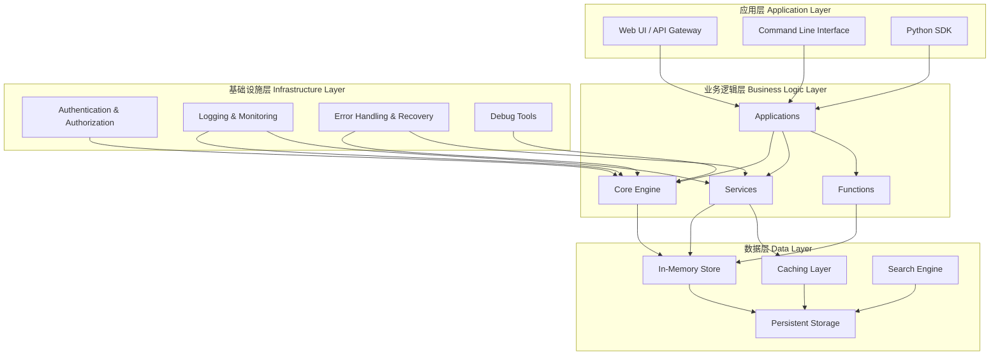

# Ontology Framework 架构设计文档

## 概述

Ontology Framework 是一个企业级语义本体管理和业务建模平台，提供完整的对象定义、关系管理、业务流程建模和数据分析功能。本文档详细描述了系统的架构设计、技术选型和设计原则。

## 系统架构概览

### 整体架构图



### 分层架构详细设计

#### 1. 应用层 (Application Layer)
**职责**: 提供用户界面和API接口，处理用户交互

**核心组件**:
- **ObjectExplorer**: 对象浏览器和导航
- **ObjectView**: 可配置的对象视图
- **Quiver**: 数据分析和可视化工具
- **REST API**: RESTful接口服务

**设计原则**:
- 单一职责：每个组件专注于特定功能
- 松耦合：组件间通过接口通信
- 可扩展：支持插件化架构

### 二、通过应用集成提供丰富的操作上下文

1. **枢轴化探索 (Pivoting) 作为上下文聚合器**
   - `ObjectExplorer.pivot_context()` 与 `PivotAggregationPlan` 为 LLM Agent 提供了类似 Object Explorer 的“Pivot”范式：以核心对象集合为起点，通过预设 Link Type 自动收集所有相关对象、属性与指标。
   - 聚合结果不仅包含目标实体列表，还会根据 `metrics` 配置执行 `ObjectSet.aggregate()`，在一次调用中即可生成资产健康、供应链等复合决策所需的上下文快照。

2. **Vertex 提供系统图谱与模拟上下文**
   - `Vertex.generate_system_graph()` 会沿 `Ontology.get_link_types_for_object()` 遍历对象图，返回结构化的节点/边清单。LLM 可以直接消费该 JSON 描述，而不是零散文本。
   - `Vertex.register_simulation()` 及 `register_function_backed_simulation()` 允许将 Functions 产出的模拟结果绑定到本体属性；`run_simulation()` 支持在执行后自动触发绑定器，将预测值落到真实对象字段上，保证可解释性。

3. **利用 Object Views 提供规范化单一视图**
   - `ObjectExplorer.describe_view()` 始终返回约定俗成的视图 Schema（自定义或 `_build_default_view()` 衍生），无论 Agent 通过哪个入口（Workshop、Quiver、Object Explorer）访问，都遵循同一套字段与指标定义。
   - `ObjectView.schema()` 输出的 widgets/属性清单可作为 Prompt 片段或 UI 配置，确保多应用共享统一视图，避免指标冲突或字段歧义。

#### 2. 业务逻辑层 (Business Logic Layer)
**职责**: 实现核心业务逻辑和本体管理

**核心组件**:
- **Ontology Engine**: 本体管理核心引擎
- **ObjectSet Service**: 对象集合管理服务
- **Action Service**: 业务动作执行服务
- **Function Registry**: 函数注册和执行

**设计模式**:
- 注册表模式：统一管理类型定义
- 策略模式：支持多种业务策略
- 观察者模式：事件驱动架构
- 工厂模式：对象和服务的创建

#### 3. 基础设施层 (Infrastructure Layer)
**职责**: 提供横切关注点服务

**核心组件**:
- **Permission System**: 权限控制和管理
- **Logging System**: 结构化日志和审计
- **Error Recovery**: 错误处理和恢复机制
- **Debug Tools**: 调试和性能分析工具

**设计原则**:
- 面向切面：横切关注点分离
- 配置驱动：支持环境配置
- 可观测性：完整的监控和追踪

#### 4. 数据层 (Data Layer)
**职责**: 数据存储和访问

**核心组件**:
- **In-Memory Store**: 高性能内存存储
- **Caching Layer**: 多级缓存策略
- **Persistent Storage**: 持久化数据存储
- **Search Engine**: 全文搜索和索引

**设计考虑**:
- 一致性：ACID事务保证
- 性能：读写分离和索引优化
- 扩展性：支持水平扩展

## 核心组件设计

### 1. Ontology Engine

```python
class Ontology:
    """本体管理引擎"""

    def __init__(self):
        self._object_types: Dict[str, ObjectType] = {}
        self._link_types: Dict[str, LinkType] = {}
        self._action_types: Dict[str, ActionType] = {}
        self._functions: Dict[str, Function] = {}
        self._object_store: Dict[str, List[ObjectInstance]] = {}
        self._link_store: Dict[str, List[Link]] = {}
```

**核心功能**:
- 类型注册和管理
- 对象实例化
- 链接关系管理
- 函数执行
- 事务处理

**设计特性**:
- **类型安全**: 强类型检查和验证
- **事务支持**: 原子性操作保证
- **扩展性**: 插件化架构
- **性能优化**: 懒加载和缓存

### 2. ObjectSet Service

```python
class ObjectSetService:
    """对象集合服务"""

    def __init__(self):
        self._storage: Dict[str, List[ObjectInstance]] = {}
        self._index: Dict[str, Dict[str, Dict[Any, List[ObjectInstance]]]] = {}

    def index_object(self, obj: ObjectInstance):
        """索引对象以支持快速查询"""

    def get_base_object_set(self, object_type: ObjectType, principal_id: str = None) -> ObjectSet:
        """获取基础对象集，包含权限检查"""

    def search(self, object_type: ObjectType, query: str) -> ObjectSet:
        """语义搜索对象"""
```

**核心功能**:
- 对象索引和搜索
- 权限控制集成
- 查询优化
- 性能监控

**设计模式**:
- **索引模式**: 多维度索引支持
- **缓存模式**: 查询结果缓存
- **权限模式**: 基于ACL的访问控制

### 3. Application Layer

#### 3.1 Object Explorer
```python
class ObjectExplorer:
    """对象浏览器"""

    def __init__(self):
        self.views: Dict[str, ObjectView] = {}

    def register_view(self, view: ObjectView):
        """注册对象视图"""

    def open(self, object_type_api_name: str, object_set: ObjectSet):
        """打开对象视图或显示默认列表"""
```

#### 3.2 Object View
```python
class ObjectView:
    """对象视图"""

    def __init__(self, object_type: ObjectType, title: str, widgets: List[str]):
        self.object_type = object_type
        self.title = title
        self.widgets = widgets

    def render(self, object_set: ObjectSet):
        """渲染视图内容"""
```

## 数据模型设计

### 1. 核心数据类型

#### ObjectType
```python
@dataclass
class ObjectType:
    """对象类型定义"""
    api_name: str
    display_name: str
    primary_key: str
    properties: Dict[str, PropertyDefinition] = field(default_factory=dict)
    derived_properties: Dict[str, DerivedPropertyDefinition] = field(default_factory=dict)
    permissions: Optional[AccessControlList] = None
    backing_datasource_id: Optional[str] = None
```

#### ObjectInstance
```python
@dataclass
class ObjectInstance:
    """对象实例"""
    object_type_api_name: str
    primary_key_value: Any
    property_values: Dict[str, Any] = field(default_factory=dict)
    ontology: Optional[Ontology] = None
```

#### ActionLog
```python
@dataclass
class ActionLog:
    """动作执行日志"""
    id: str
    action_type_api_name: str
    user_id: str
    timestamp: float
    parameters: Dict[str, Any]
    changes: List[Dict[str, Any]]
```

### 2. 关系模型

#### 关系类型
- **一对一 (One-to-One)**: 单一映射关系
- **一对多 (One-to-Many)**: 层级关系
- **多对多 (Many-to-Many)**: 网状关系

#### 关系导航
```python
class ObjectSet:
    """对象集合支持关系导航"""

    def search_around(self, link_type_api_name: str, **filters) -> ObjectSet:
        """通过链接关系导航到相关对象"""

    def aggregate(self, property_name: str, function: str) -> float:
        """聚合计算"""
```

## 安全架构

### 1. 权限模型

#### ACL (Access Control List)
```python
class AccessControlList:
    """访问控制列表"""

    def __init__(self):
        self.permissions: Dict[str, Set[PermissionType]] = {}

    def grant(self, principal_id: str, permission: PermissionType):
        """授予权限"""

    def revoke(self, principal_id: str, permission: PermissionType):
        """撤销权限"""

    def check(self, principal_id: str, permission: PermissionType) -> bool:
        """检查权限"""
```

#### 权限类型
- **VIEW**: 查看权限
- **EDIT**: 编辑权限
- **DELETE**: 删除权限
- **ADMIN**: 管理权限

### 2. 安全机制

#### 认证和授权
- **JWT Token**: 无状态认证
- **RBAC**: 基于角色的访问控制
- **ABAC**: 基于属性的访问控制

#### 数据安全
- **输入验证**: 严格的输入验证
- **SQL注入防护**: 参数化查询
- **XSS防护**: 输出编码和净化

## 性能设计

### 1. 性能优化策略

#### 1.1 缓存策略
```python
# 多级缓存架构
缓存层次:
  L1: 应用内缓存 (内存)
  L2: 分布式缓存 (Redis)
  L3: 查询结果缓存
  L4: 静态资源缓存
```

#### 1.2 索引策略
```python
# 多维度索引
索引类型:
  - 主键索引 (Primary Key)
  - 唯一索引 (Unique Index)
  - 复合索引 (Composite Index)
  - 全文索引 (Full-text Index)
```

### 2. 性能基准

#### 2.1 响应时间目标
- **对象创建**: < 200ms
- **对象查询**: < 100ms
- **权限检查**: < 50ms
- **复杂查询**: < 500ms
- **批量操作**: < 2000ms

#### 2.2 并发性能
- **并发用户**: 1,000+
- **QPS**: 10,000+
- **峰值TPS**: 50,000+

## 可观测性设计

### 1. 监控体系

#### 1.1 指标监控
```python
# 核心指标
监控指标:
  业务指标:
    - 对象操作数
    - 查询响应时间
    - 错误率

  系统指标:
    - CPU使用率
    - 内存使用率
    - 磁盘I/O
    - 网络流量

  应用指标:
    - JVM指标
    - 线程池状态
    - 连接池状态
```

#### 1.2 日志系统
```python
# 结构化日志
日志级别:
  - DEBUG: 详细调试信息
  - INFO: 一般信息
  - WARN: 警告信息
  - ERROR: 错误信息
  - FATAL: 致命错误

日志格式:
  - 时间戳
  - 级别
  - 模块
  - 请求ID
  - 用户ID
  - 消息
  - 上下文信息
```

### 2. 链路追踪

#### 2.1 分布式追踪
```python
# 追踪标识
Trace ID: 全局唯一标识
Span ID: 操作单元标识
Parent ID: 父操作标识
```

#### 2.2 上下文传播
```python
class LoggingContext:
    """日志上下文管理"""

    def __init__(self, **kwargs):
        self.context = kwargs

    def __enter__(self):
        # 设置上下文
        return self

    def __exit__(self, exc_type, exc_val, exc_tb):
        # 清理上下文
        pass
```

## 扩展性设计

### 1. 插件架构

#### 1.1 插件接口
```python
class Plugin:
    """插件基类"""

    def initialize(self, ontology: Ontology):
        """初始化插件"""
        pass

    def get_actions(self) -> List[ActionType]:
        """获取插件提供的动作"""
        return []

    def cleanup(self):
        """清理资源"""
        pass
```

#### 1.2 插件注册
```python
class PluginManager:
    """插件管理器"""

    def __init__(self):
        self.plugins: Dict[str, Plugin] = {}

    def register_plugin(self, name: str, plugin: Plugin):
        """注册插件"""
        self.plugins[name] = plugin

    def load_plugin(self, plugin_path: str):
        """动态加载插件"""
        pass
```

### 2. 扩展点

#### 2.1 函数扩展
```python
@ontology_function(
    api_name="custom_function",
    inputs={"input1": PrimitiveType(PropertyType.STRING)}
)
def custom_function(input1: str) -> str:
    """自定义函数"""
    return input1.upper()
```

#### 2.2 动作扩展
```python
# 自定义动作类型
custom_action = ActionType(
    api_name="custom_action",
    display_name="Custom Action",
    target_object_types=["custom_object"]
)

custom_action.add_parameter("param1", "string", required=True)
```

## 部署架构

### 1. 部署模式

#### 1.1 单体部署
```yaml
# docker-compose.yml
version: '3.8'
services:
  ontology-app:
    image: ontology-framework:latest
    ports:
      - "8080:8080"
    environment:
      - SPRING_PROFILES_ACTIVE=production
    volumes:
      - ./data:/app/data
      - ./logs:/app/logs
```

#### 1.2 微服务部署
```yaml
# Kubernetes部署
apiVersion: apps/v1
kind: Deployment
metadata:
  name: ontology-api
spec:
  replicas: 3
  selector:
    matchLabels:
      app: ontology-api
  template:
    metadata:
      labels:
        app: ontology-api
    spec:
      containers:
      - name: ontology-api
        image: ontology-framework:latest
        ports:
        - containerPort: 8080
        env:
        - name: SPRING_PROFILES_ACTIVE
          value: "production"
```

### 2. 配置管理

#### 2.1 环境配置
```python
# application.yml
spring:
  profiles:
    active: ${SPRING_PROFILES_ACTIVE:development}

# 开发环境
spring:
  config:
    activate:
      on-profile: "development"
  datasource:
    url: jdbc:h2:mem:testdb
    driver-class-name: org.h2.Driver

# 生产环境
---
spring:
  config:
    activate:
      on-profile: "production"
  datasource:
    url: jdbc:postgresql://localhost:5432/ontology
    username: ${DB_USERNAME}
    password: ${DB_PASSWORD}
    driver-class-name: org.postgresql.Driver
```

## 质量保证

### 1. 测试策略

#### 1.1 测试金字塔
```
测试金字塔:
  E2E Tests (5%)
  ├── 业务流程测试
  └── 用户场景测试

  Integration Tests (25%)
  ├── API集成测试
  ├── 数据库集成测试
  └── 服务间集成测试

  Unit Tests (70%)
  ├── 单元测试
  ├── 模块测试
  └── 组件测试
```

#### 1.2 测试覆盖率
- **单元测试覆盖率**: > 80%
- **集成测试覆盖率**: > 70%
- **E2E测试覆盖率**: > 60%

### 2. 代码质量

#### 2.1 静态分析
```yaml
# .pre-commit-config.yaml
repos:
  - repo: local
    hooks:
      - id: black
        name: black
        entry: black
        language_version: python3
      - id: isort
        name: isort
        entry: isort
      - id: flake8
        name: flake8
      - id: mypy
        name: mypy
```

#### 2.2 安全扫描
```yaml
# bandit配置
exclude_dirs:
  - tests/
  - test_*
skips:
  - B101  # assert_used
  - B601  # shell_injection_process
```

## 总结

Ontology Framework 采用分层架构设计，通过清晰的职责分离和模块化设计，实现了高内聚、低耦合的系统架构。系统具备良好的可扩展性、可维护性和性能表现，能够满足企业级应用的需求。

关键特性：
- **分层架构**: 清晰的职责分离
- **类型安全**: 强类型检查和验证
- **高性能**: 多级缓存和索引优化
- **可观测**: 完整的监控和追踪
- **安全性**: 完善的权限控制
- **可扩展**: 插件化和配置化架构

通过这样的架构设计，Ontology Framework 能够支持大规模的语义本体管理和业务建模需求，为企业级应用提供坚实的技术基础。