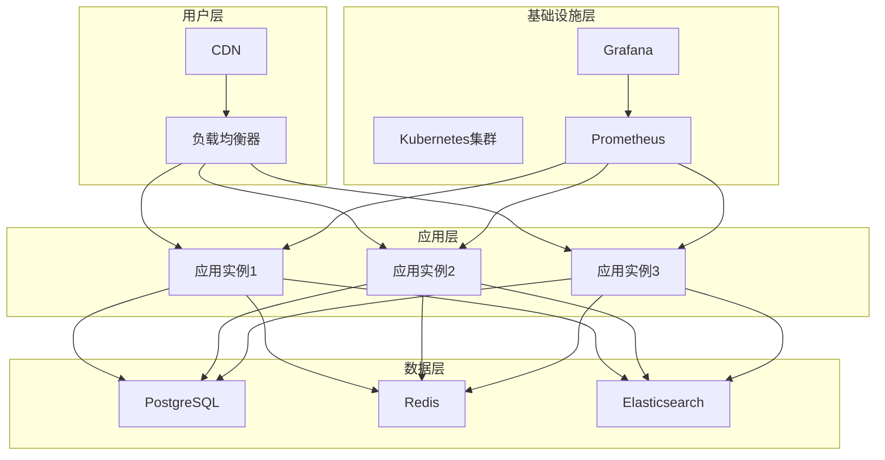

# Ontology Framework 部署指南

## 概述

本指南提供了 Ontology Framework 的完整部署方案，包括开发、测试和生产环境的部署配置。

## 目录

1. [部署架构](#部署架构)
2. [环境准备](#环境准备)
3. [Docker 部署](#docker-部署)
4. [Kubernetes 部署](#kubernetes-部署)
5. [云平台部署](#云平台部署)
6. [监控和日志](#监控和日志)
7. [备份和恢复](#备份和恢复)
8. [运维管理](#运维管理)

## 部署架构

### 部署架构图



### 服务组件

| 组件 | 功能 | 部署方式 | 高可用 |
|------|------|----------|--------|
| **API服务** | REST API接口 | 多实例 + 负载均衡 | ✅ |
| **Web UI** | 用户界面 | 多实例 + 负载均衡 | ✅ |
| **数据库** | 数据持久化 | 主从复制 | ✅ |
| **缓存** | 数据缓存 | Redis 集群 | ✅ |
| **搜索** | 全文搜索 | Elasticsearch 集群 | ✅ |
| **监控** | 系统监控 | Prometheus + Grafana | ✅ |
| **日志** | 日志收集 | ELK Stack | ✅ |

## 环境准备

### 系统要求

#### 最小配置
```yaml
CPU: 2核心
内存: 4GB
存储: 20GB SSD
网络: 100Mbps
操作系统: Linux (Ubuntu 20.04+ / CentOS 8+)
```

#### 推荐配置
```yaml
CPU: 4核心以上
内存: 8GB以上
存储: 100GB SSD
网络: 1Gbps
操作系统: Linux (Ubuntu 22.04+ / CentOS 9+)
```

#### 生产配置
```yaml
CPU: 8核心以上
内存: 16GB以上
存储: 500GB SSD
网络: 10Gbps
操作系统: Linux (Ubuntu 22.04+ / RHEL 9+)
高可用: 多AZ部署
```

### 依赖软件

```bash
# 基础依赖
Python 3.8+
Docker 20.10+
Kubernetes 1.20+

# 数据库
PostgreSQL 13+
Redis 6.2+
Elasticsearch 7.10+

# 监控
Prometheus 2.30+
Grafana 8.0+
```

### 网络配置

#### 端口开放
```bash
# 应用端口
8080 - API服务端口
8081 - Web UI端口
9090 - 管理端口

# 数据库端口
5432 - PostgreSQL
6379 - Redis
9200 - Elasticsearch

# 监控端口
3000 - Grafana
9091 - Prometheus
```

#### 防火墙配置
```bash
# 入站规则
允许 80, 443 - HTTP/HTTPS
允许 22 - SSH
允许特定IP范围

# 出站规则
允许 HTTP/HTTPS
允许 DNS
允许 NTP
允许包管理器
```

## Docker 部署

### Dockerfile

```dockerfile
# 多阶段构建
FROM python:3.11-slim as builder

WORKDIR /app
COPY requirements.txt .
RUN pip install --no-cache-dir -r requirements.txt

FROM python:3.11-slim

# 创建应用用户
RUN groupadd -r appuser && useradd -r -g appuser appuser

# 设置工作目录
WORKDIR /app

# 复制Python包
COPY --from=builder /usr/local/lib/python3.11/site-packages /usr/local/lib/python3.11/site-packages
COPY src /app/src

# 复制应用代码
COPY . .

# 设置权限
RUN chown -R appuser:appuser /app

# 切换用户
USER appuser

# 健康检查
HEALTHCHECK --interval=30s --timeout=3s CMD curl -f http://localhost:8080/health || exit 1

# 暴露端口
EXPOSE 8080

# 启动命令
CMD ["python", "-m", "src.main"]
```

### docker-compose.yml

```yaml
version: '3.8'

services:
  # API服务
  ontology-api:
    build: .
    ports:
      - "8080:8080"
    environment:
      - SPRING_PROFILES_ACTIVE=production
      - DATABASE_URL=postgresql://postgres:5432/ontology
      - REDIS_URL=redis://redis:6379/0
      - ELASTICSEARCH_URL=http://elasticsearch:9200
    depends_on:
      - postgres
      - redis
      - elasticsearch
    volumes:
      - ./data:/app/data
      - ./logs:/app/logs
    restart: unless-stopped
    healthcheck:
      test: ["CMD", "curl", "-f", "http://localhost:8080/health"]
      interval: 30s
      timeout: 10s
      retries: 3

  # PostgreSQL
  postgres:
    image: postgres:15-alpine
    environment:
      - POSTGRES_DB=ontology
      - POSTGRES_USER=ontology
      - POSTGRES_PASSWORD=ontology_password
      - POSTGRES_DB_INITDB_ARGS=--encoding=UTF-8
    volumes:
      - postgres_data:/var/lib/postgresql/data
      - ./docker/init-db.sql:/docker-entrypoint-initdb.d
    ports:
      - "5432:5432"
    restart: unless-stopped
    healthcheck:
      test: ["CMD-SHELL", "pg_isready -U ontology"]
      interval: 10s
      timeout: 5s
      retries: 5

  # Redis
  redis:
    image: redis:7-alpine
    command: redis-server --appendonly yes --requirepass redis_password
    volumes:
      - redis_data:/data
    ports:
      - "6379:6379"
    restart: unless-stopped
    healthcheck:
      test: ["CMD", "redis-cli", "ping"]
      interval: 10s
      timeout: 3s
      retries: 3

  # Elasticsearch
  elasticsearch:
    image: elasticsearch:7.17.0
    environment:
      - discovery.type=single-node
      - "ES_JAVA_OPTS=-Xms1g -Xmx1g"
    volumes:
      - es_data:/usr/share/elasticsearch/data
    ports:
      - "9200:9200"
    restart: unless-stopped
    healthcheck:
      test: ["CMD-SHELL", "curl -f http://localhost:9200/_cluster/health"]
      interval: 30s
      timeout: 10s
      retries: 3

  # Nginx 负载均衡器
  nginx:
    image: nginx:alpine
    ports:
      - "80:80"
      - "443:443"
    volumes:
      - ./nginx.conf:/etc/nginx/nginx.conf
      - ./ssl:/etc/nginx/ssl
    depends_on:
      - ontology-api
    restart: unless-stopped

volumes:
  postgres_data:
  redis_data:
  es_data:
  nginx_ssl:

networks:
  default:
    driver: bridge
```

### 环境配置

#### application.yml
```yaml
# 生产环境配置
spring:
  profiles:
    active: production

  datasource:
    url: jdbc:postgresql://postgres:5432/ontology
    username: ${DB_USERNAME:ontology}
    password: ${DB_PASSWORD:ontology_password}
    driver-class-name: org.postgresql.Driver
    hikari:
      maximum-pool-size: 20
      minimum-idle: 5
      connection-timeout: 30000
      idle-timeout: 600000
      max-lifetime: 1800000

  jpa:
    hibernate:
      ddl-auto: validate
      naming:
        physical-strategy: org.hibernate.boot.model.naming.SpringPhysicalNamingStrategy

  redis:
    host: redis
    port: 6379
    password: ${REDIS_PASSWORD:redis_password}
    database: 0
    lettuce:
      pool:
        max-active: 8
        max-idle: 8
        min-idle: 0

  elasticsearch:
    rest:
      uris: http://elasticsearch:9200
    connection-timeout: 5s
    read-timeout: 30s

management:
  endpoints:
    web:
      exposure:
        include: health,info,metrics,prometheus
  endpoint:
      health:
        show-details: always
```

## Kubernetes 部署

### 命名空间

```yaml
# namespace.yaml
apiVersion: v1
kind: Namespace
metadata:
  name: ontology-framework
  labels:
    name: ontology-framework
```

### ConfigMap

```yaml
# configmap.yaml
apiVersion: v1
kind: ConfigMap
metadata:
  name: ontology-config
  namespace: ontology-framework
data:
  application.yml: |
    spring:
      profiles:
        active: production
      datasource:
        url: jdbc:postgresql://postgres:5432/ontology
        username: ontology
        password: ${DB_PASSWORD}
      redis:
        host: redis
        port: 6379
        password: ${REDIS_PASSWORD}
```

### Secret

```yaml
# secret.yaml
apiVersion: v1
kind: Secret
metadata:
  name: ontology-secrets
  namespace: ontology-framework
type: Opaque
data:
  db-password: b2507063d1a3f2
  redis-password: 68126b5d2a8c4
```

### Deployment

```yaml
# deployment.yaml
apiVersion: apps/v1
kind: Deployment
metadata:
  name: ontology-api
  namespace: ontology-framework
spec:
  replicas: 3
  selector:
    matchLabels:
      app: ontology-api
  template:
    metadata:
      labels:
        app: ontology-api
    spec:
      containers:
      - name: ontology-api
        image: ontology-framework:latest
        ports:
        - containerPort: 8080
          name: http
        env:
        - name: SPRING_PROFILES_ACTIVE
          value: "production"
        - name: DATABASE_URL
          valueFrom:
            secretKeyRef:
              name: ontology-secrets
              key: database-url
        volumeMounts:
        - name: config-volume
          mountPath: /app/config
        - name: logs-volume
          mountPath: /app/logs
        livenessProbe:
          httpGet:
            path: /health
            port: 8080
          initialDelaySeconds: 60
          periodSeconds: 30
        readinessProbe:
          httpGet:
            path: /health
            port: 8080
          initialDelaySeconds: 30
          periodSeconds: 10
        resources:
          requests:
            memory: "512Mi"
            cpu: "250m"
          limits:
            memory: "1Gi"
            cpu: "500m"
      volumes:
      - name: config-volume
        configMap:
          name: ontology-config
      - name: logs-volume
        persistentVolumeClaim:
          claimName: logs-pvc
```

### Service

```yaml
# service.yaml
apiVersion: v1
kind: Service
metadata:
  name: ontology-api-service
  namespace: ontology-framework
spec:
  selector:
    app: ontology-api
  ports:
  - port: 8080
    targetPort: 8080
    name: http
  type: ClusterIP
  sessionAffinity: ClientIP
```

### Ingress

```yaml
# ingress.yaml
apiVersion: networking.k8s.io/v1
kind: Ingress
metadata:
  name: ontology-ingress
  namespace: ontology-framework
spec:
  rules:
  - host: ontology.example.com
    http:
      paths:
      - path: /
        pathType: Prefix
        backend:
          service:
          name: ontology-api-service
          port:
            number: 8080
  tls:
  - hosts:
    - ontology.example.com
    secretName: ontology-tls
```

### PersistentVolume

```yaml
# pvc.yaml
apiVersion: v1
kind: PersistentVolumeClaim
metadata:
  name: logs-pvc
  namespace: ontology-framework
spec:
  accessModes:
    - ReadWriteOnce
  resources:
    requests:
      storage: 10Gi
```

## 云平台部署

### AWS 部署

#### ECS (Elastic Container Service)

```json
{
  "family": "ecs-task-definition",
  "networkMode": "awsvpc",
  "requiresCompatibilities": ["FARGATE"],
  "cpu": "1024",
  "memory": "2048",
  "executionRoleArn": "arn:aws:iam::role:ecsTaskExecutionRole",
  "containerDefinitions": [
    {
      "name": "ontology-api",
      "image": "your-account.dkr.ecr.amazonaws.com/ontology-framework:latest",
      "portMappings": [
        {
          "containerPort": 8080,
          "hostPort": 8080
        }
      ],
      "environment": [
        {
          "name": "SPRING_PROFILES_ACTIVE",
          "value": "aws"
        },
        {
          "name": "AWS_REGION",
          "value": "us-west-2"
        }
      ],
      "logConfiguration": {
        "logDriver": "awslogs",
        "options": {
          "awslogs-group": "/ecs/ontology",
          "awslogs-stream-prefix": "ecs"
        }
      }
    }
  ]
}
```

#### RDS 数据库

```yaml
# rds.yaml
Resources:
  MyDatabase:
    Type: AWS::RDS::DBInstance
    Properties:
      DBInstanceIdentifier: ontology-db
      DBInstanceClass: db.t3.medium
      Engine: postgres
      EngineVersion: "15.4"
      MasterUsername: ontology
      MasterUserPassword: !Ref DatabasePassword
      AllocatedStorage: 100
      StorageType: gp3
      VPCSecurityGroups:
        - !Ref SecurityGroup
      BackupRetentionPeriod: 7
      MultiAZ: true
```

#### ElastiCache

```yaml
# elasticache.yaml
Resources:
  MyRedisCluster:
    Type: AWS::ElastiCache::ReplicationGroup
    Properties:
      CacheNodeType: cache.t3.micro
      Engine: redis
      EngineVersion: 6.2
      NumCacheClusters: 1
      ReplicationGroupId: ontology-redis
      NumNodeGroups: 2
      AutomaticFailoverEnabled: true
      SecurityGroupIds:
        - !Ref CacheSecurityGroup
```

### Azure 部署

#### AKS (Azure Kubernetes Service)

```bash
# 创建资源组
az group create --name ontology-rg --location eastus

# 创建AKS集群
az aks create \
  --resource-group ontology-rg \
  --name ontology-aks \
  --node-count 3 \
  --enable-addons monitoring \
  --enable-addons ingress \
  --dns-service-ip
```

#### 应用部署

```yaml
# k8s-deployment.yaml
apiVersion: apps/v1
kind: Deployment
metadata:
  name: ontology-api
  namespace: default
spec:
  replicas: 3
  selector:
    matchLabels:
      app: ontology-api
  template:
    metadata:
      labels:
        app: ontology-api
    spec:
      containers:
      - name: ontology-api
        image: yourregistry.azurecr.io/ontology-framework:latest
        ports:
        - containerPort: 8080
        env:
        - name: AZURE_CLIENT_ID
          valueFrom:
            secretKeyRef:
              name: ontology-secrets
              key: azure-client-id
```

#### Azure Database

```bash
# 创建 PostgreSQL
az postgres server create \
  --resource-group ontology-rg \
  --name ontology-db \
  --version 13 \
  --admin-user ontology \
  --admin-password $(openssl rand -base64 32) \
  --storage-size 128GB \
  --sku-name B_Gen5_2 \
  --location eastus
```

## 监控和日志

### Prometheus 配置

#### prometheus.yml
```yaml
global:
  scrape_interval: 15s
  evaluation_interval: 15s

rule_files:
  - "ontology_rules.yml"

scrape_configs:
  - job_name: 'ontology-api'
    static_configs:
      - targets: ['localhost:8080']
    metrics_path: /actuator/prometheus
    scrape_interval: 10s

  - job_name: 'kubernetes-pods'
    kubernetes_sd_configs:
    - role: pod
    relabel_configs:
      - source_labels: [__meta_kubernetes_pod_label]
        target_label: __meta_kubernetes_pod_label_
        regex: false
```

### 告警规则

#### ontology_rules.yml
```yaml
groups:
  - name: ontology.rules
    rules:
      - alert: HighErrorRate
        expr: rate(http_requests_total{status=~"5.."}[5m]) > 0.1
        for: 5m
        labels:
          severity: warning

      - alert: HighMemoryUsage
        expr: (node_memory_MemAvailable_bytes / node_memory_MemTotal_bytes) * 100 < 20
        for: 2m
        labels:
          severity: critical

      - alert: DatabaseConnectionsHigh
        expr: hikaric_connections_active / hikaric_connections_max > 0.8
        for: 5m
        labels:
          severity: warning
```

### Grafana 仪表盘

#### 仪表盘配置
```json
{
  "dashboard": {
    "id": null,
    "title": "Ontology Framework Dashboard",
    "tags": ["ontology"],
    "timezone": "browser",
    "panels": [
      {
        "type": "stat",
        "title": "API 请求总数",
        "targets": [
          {
            "expr": "rate(http_requests_total[5m])",
            "legendFormat": "{{method}} {{uri}}"
          }
        ]
      },
      {
        "type": "graph",
        "title": "响应时间",
        "targets": [
          {
            "expr": "histogram_quantile(0.95)",
            "legendFormat": "95th percentile"
          }
        ]
      }
    ]
  }
}
```

## 备份和恢复

### 数据库备份

#### PostgreSQL 备份脚本

```bash
#!/bin/bash
# backup.sh
DB_NAME="ontology"
BACKUP_DIR="/backup/postgresql"
DATE=$(date +%Y%m%d_%H%M%S)
BACKUP_FILE="$BACKUP_DIR/ontology_backup_$DATE.sql"

mkdir -p $BACKUP_DIR

# 创建备份
pg_dump -h localhost -U ontology -d $DB_NAME > $BACKUP_FILE

# 压缩备份
gzip $BACKUP_FILE

# 清理旧备份（保留7天）
find $BACKUP_DIR -name "*.sql.gz" -mtime +7 -delete

echo "备份完成: $BACKUP_FILE.gz"
```

#### 恢复脚本

```bash
#!/bin/bash
# restore.sh
DB_NAME="ontology"
BACKUP_FILE=$1

if [ -z "$BACKUP_FILE" ]; then
    echo "请提供备份文件路径"
    exit 1
fi

# 解压备份
if [[ $BACKUP_FILE == *.gz ]]; then
    gunzip -c $BACKUP_FILE | psql -h localhost -U ontology -d $DB_NAME
else
    psql -h localhost -U ontology -d $DB_NAME < $BACKUP_FILE
fi

echo "恢复完成"
```

### 自动化备份

#### Kubernetes CronJob

```yaml
# backup-cronjob.yaml
apiVersion: batch/v1
kind: CronJob
metadata:
  name: postgres-backup
  namespace: ontology-framework
spec:
  schedule: "0 2 * * *"  # 每天凌晨2点
  jobTemplate:
    spec:
      template:
        spec:
          containers:
          - name: postgres-backup
            image: postgres:15-alpine
            env:
            - name: PGPASSWORD
              valueFrom:
                secretKeyRef:
                  name: postgres-secret
                  key: password
            command:
            - /bin/bash
            - -c
              |
                pg_dump -h $POSTGRES_HOST -U $POSTGRES_USER $POSTGRES_DB | gzip > /backup/backup-$(date +%Y%m%d).sql.gz
          volumeMounts:
          - name: backup-storage
            mountPath: /backup
          restartPolicy: OnFailure
  successfulJobsHistoryLimit: 3
  failedJobsHistoryLimit: 1
```

## 运维管理

### 健康检查

#### 健康检查端点

```python
# health_check.py
from fastapi import FastAPI
from ontology_framework import Ontology

app = FastAPI()
ontology = Ontology()

@app.get("/health")
async def health_check():
    return {
        "status": "healthy",
        "timestamp": datetime.now().isoformat(),
        "version": "1.0.0",
        "database": await check_database(),
        "redis": await check_redis(),
        "elasticsearch": await check_elasticsearch()
    }

async def check_database():
    # 检查数据库连接
    try:
        # 执行简单查询
        return {"status": "healthy", "message": "Database connection OK"}
    except Exception as e:
        return {"status": "unhealthy", "error": str(e)}

async def check_redis():
    # 检查Redis连接
    try:
        # 执行ping测试
        return {"status": "healthy", "message": "Redis connection OK"}
    except Exception as e:
        return {"status": "unhealthy", "error": str(e)}

async def check_elasticsearch():
    # 检查Elasticsearch连接
    try:
        # 执行集群健康检查
        return {"status": "healthy", "message": "Elasticsearch OK"}
    except Exception as e:
        return {"status": "unhealthy", "error": str(e)}
```

### 性能监控

#### 性能指标

```python
# metrics.py
from prometheus_client import Counter, Histogram, Gauge
import time

# 性能计数器
REQUEST_COUNT = Counter('ontology_requests_total', 'Total API requests', ['method', 'endpoint'])
REQUEST_DURATION = Histogram('ontology_request_duration_seconds', 'Request duration')

# 性能仪表盘
ACTIVE_CONNECTIONS = Gauge('ontology_active_connections', 'Active connections')
MEMORY_USAGE = Gauge('ontology_memory_usage_bytes', 'Memory usage')

def track_request(method, endpoint):
    start_time = time.time()
    REQUEST_COUNT.labels(method=method, endpoint=endpoint).inc()
    return REQUEST_DURATION.time(start_time)
```

### 日志管理

#### 日志配置

```yaml
# logback-spring.xml
<configuration>
    <appender name="FILE" class="ch.qos.logback.core.FileAppender">
        <file>logs/ontology.log</file>
        <rollingPolicy class="ch.qos.logback.core.rolling.SizeAndTimeBasedRollingPolicy">
            <fileNamePattern>logs/ontology.%d{yyyy-MM-dd}.log</fileNamePattern>
            <maxFileSize>100MB</maxFileSize>
            <maxHistory>30</maxHistory>
            <totalSize>10GB</totalSize>
        </rollingPolicy>
        <encoder>
            <pattern>%d{yyyy-MM-dd HH:mm:ss} [%thread] %-5level %logger{36} - %msg%n</pattern>
        </encoder>
    </appender>

    <logger name="com.ontology" level="INFO"/>
    <root level="INFO">
        <appender-ref ref="FILE"/>
    </root>
</configuration>
```

## 安全配置

### HTTPS 配置

#### Nginx SSL 配置

```nginx
server {
    listen 443 ssl http2;
    server_name ontology.example.com;

    ssl_certificate /etc/ssl/cert.pem;
    ssl_certificate_key /etc/ssl/key.pem;

    ssl_protocols TLSv1.2 TLSv1.3;
    ssl_ciphers HIGH:!aNULL:!MD5;
    ssl_prefer_server_ciphers on;

    # 安全头
    add_header X-Frame-Options DENY;
    add_header X-Content-Type-Options nosniff;
    add_header X-XSS-Protection "1; mode=block";
    add_header Strict-Transport-Security "max-age=31536000";
}
```

### 访问控制

```python
# security.py
from fastapi import HTTPException, status
from fastapi.security import HTTPBasic, HTTPBearer
from fastapi.security.http_basic import HTTPBasicCredentials

class SecurityConfig:
    def __init__(self):
        self.allowed_ips = {"192.168.1.0/24", "10.0.0.0/8"}
        self.rate_limits = {
            "default": "100/minute",
            "admin": "1000/minute"
        }

    def check_ip(self, client_ip: str) -> bool:
        return client_ip in self.allowed_ips

    def check_rate_limit(self, user: str, endpoint: str) -> bool:
        limit = self.rate_limits.get(user, self.rate_limits["default"])
        # 检查Redis中的请求计数
        current_count = redis.get(f"rate_limit:{user}:{endpoint}")
        return current_count < limit
```

## 故障排除

### 常见问题及解决方案

#### 1. 数据库连接问题

**问题**: 连接数据库超时
```bash
# 检查数据库状态
pg_isready -h localhost -U ontology

# 检查连接数
SELECT count(*) FROM pg_stat_activity;

# 检查慢查询
SELECT query, mean_time, calls
FROM pg_stat_statements
ORDER BY mean_time DESC
LIMIT 10;
```

**解决方案**:
```yaml
# 连接池配置优化
spring:
  datasource:
    hikari:
      maximum-pool-size: 20
      minimum-idle: 5
      connection-timeout: 30000
      idle-timeout: 600000
```

#### 2. 内存不足问题

**问题**: OutOfMemoryError
```bash
# 检查内存使用
free -h
df -h

# 检查Java堆内存
jmap -heap -histo:live <pid>

# 分析GC日志
grep "GC" logs/application.log
```

**解决方案**:
```yaml
# JVM参数优化
JAVA_OPTS="-Xms512m -Xmx2g -XX:+UseG1GC"
```

#### 3. 性能问题

**问题**: 响应时间过长
```bash
# 分析慢查询
EXPLAIN ANALYZE SELECT * FROM table WHERE condition;

# 检查索引使用
SELECT schemaname, tablename, indexname, idx_scan, idx_tup_read, idx_fetch
FROM pg_stat_user_tables;
```

**解决方案**:
```python
# 添加索引
CREATE INDEX CONCURRENTLY idx_table_column ON table(column);

# 分析查询计划
EXPLAIN (ANALYZE, BUFFERS) SELECT * FROM table WHERE condition;
```

### 日志分析

#### 错误日志分析

```bash
# 查看错误日志
grep "ERROR" logs/application.log | tail -n 50

# 统计错误类型
grep "ERROR" logs/application.log | awk '{print $1}' | sort | uniq -c | sort -nr

# 查看特定时间段的错误
grep "ERROR" logs/application.log | grep "2024-01-01"
```

#### 性能日志分析

```bash
# 分析慢请求
grep "slow" logs/application.log

# 统计响应时间
grep "time=" logs/application.log | sed 's/.*time=\([0-9.]*\).*/\1/' | sort -n | awk '{sum+=$1} END {print sum}'
```

## 总结

本文档提供了 Ontology Framework 的完整部署指南，涵盖了从开发到生产的全生命周期管理。通过遵循最佳实践，可以确保系统的稳定性、安全性和性能。

关键成功因素：
1. **环境一致性**：确保开发、测试、生产环境配置一致
2. **监控完善**：建立全面的监控和告警体系
3. **自动化**：实现自动化的部署和运维流程
4. **备份策略**：建立可靠的数据备份和恢复机制
5. **安全加固**：实施多层次的安全防护措施

通过系统化的部署和运维，Ontology Framework 可以在复杂的企业环境中稳定运行，为业务提供可靠的服务。