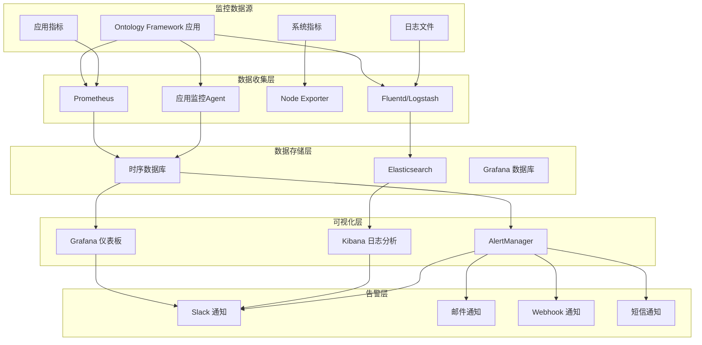
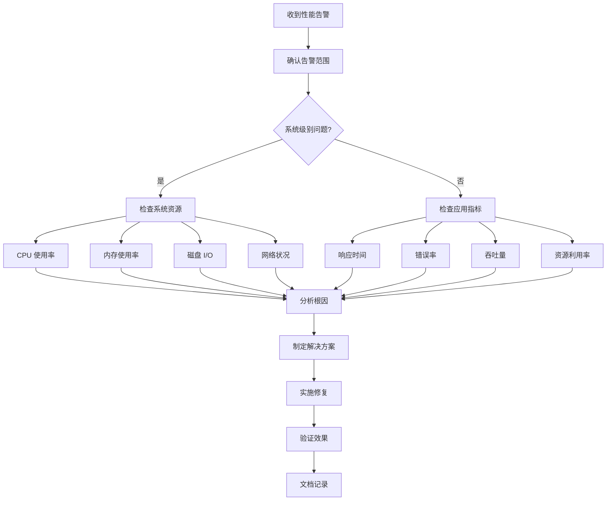
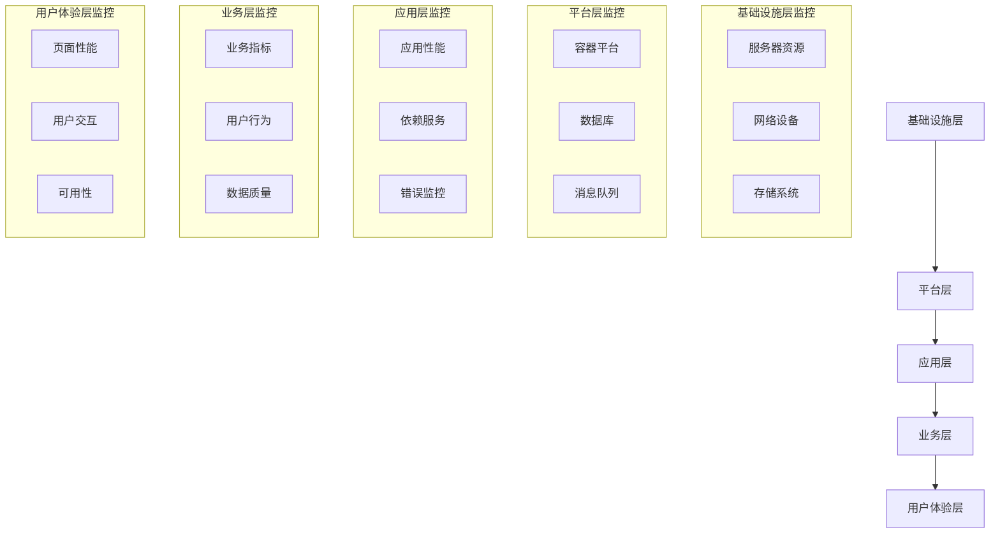

# 生产环境监控指南

## 概述

本指南提供 Ontology Framework 在生产环境中的完整监控解决方案，包括系统监控、应用监控、日志管理、告警配置和故障排查的最佳实践。

## 目录

1. [监控架构](#监控架构)
2. [基础设施监控](#基础设施监控)
3. [应用性能监控](#应用性能监控)
4. [日志管理](#日志管理)
5. [告警配置](#告警配置)
6. [监控工具集成](#监控工具集成)
7. [故障排查](#故障排查)
8. [监控最佳实践](#监控最佳实践)

## 监控架构

### 整体架构图



### 监控层次


## 基础设施监控

### 1. 服务器监控

#### 核心指标

**系统资源指标**
```yaml
系统监控指标:
  CPU:
    - 使用率 (user, system, idle, iowait)
    - 负载平均值 (1m, 5m, 15m)
    - 上下文切换率
    - CPU 饥饿时间

  内存:
    - 总内存、已用内存、可用内存
    - 内存使用率
    - 交换空间使用情况
    - 缓存和缓冲区使用

  磁盘:
    - 磁盘使用率
    - I/O 读写速率
    - I/O 等待时间
    - 磁盘队列长度

  网络:
    - 网络吞吐量 (bytes/s)
    - 网络包速率 (packets/s)
    - 网络错误率
    - TCP 连接状态
```

**Prometheus 配置示例**
```yaml
# prometheus.yml
global:
  scrape_interval: 15s
  evaluation_interval: 15s

scrape_configs:
  # Node Exporter - 系统指标
  - job_name: 'node-exporter'
    static_configs:
      - targets: ['localhost:9100']

  # 应用指标
  - job_name: 'ontology-framework'
    static_configs:
      - targets: ['localhost:8080']
    metrics_path: '/metrics'
    scrape_interval: 10s

rule_files:
  - "alert_rules.yml"
```

### 2. 容器监控 (Docker/Kubernetes)

#### Kubernetes 监控配置

```yaml
# kubernetes-monitoring.yaml
apiVersion: v1
kind: ConfigMap
metadata:
  name: prometheus-config
data:
  prometheus.yml: |
    global:
      scrape_interval: 15s

    scrape_configs:
      # Kubernetes API Server
      - job_name: 'kubernetes-apiservers'
        kubernetes_sd_configs:
          - role: endpoints
        scheme: https
        tls_config:
          ca_file: /var/run/secrets/kubernetes.io/serviceaccount/ca.crt
        bearer_token_file: /var/run/secrets/kubernetes.io/serviceaccount/token

      # Kubelet
      - job_name: 'kubernetes-nodes'
        kubernetes_sd_configs:
          - role: node
        scheme: https
        tls_config:
          ca_file: /var/run/secrets/kubernetes.io/serviceaccount/ca.crt
        bearer_token_file: /var/run/secrets/kubernetes.io/serviceaccount/token

      # Ontology Framework Pods
      - job_name: 'ontology-framework-pods'
        kubernetes_sd_configs:
          - role: pod
        relabel_configs:
          - source_labels: [__meta_kubernetes_pod_label_app]
            action: keep
            regex: ontology-framework
          - source_labels: [__meta_kubernetes_pod_annotation_prometheus_io_scrape]
            action: keep
            regex: true
```

#### Docker 监控

```yaml
# docker-compose.monitoring.yml
version: '3.8'

services:
  prometheus:
    image: prom/prometheus:latest
    ports:
      - "9090:9090"
    volumes:
      - ./prometheus.yml:/etc/prometheus/prometheus.yml
      - prometheus_data:/prometheus
    command:
      - '--config.file=/etc/prometheus/prometheus.yml'
      - '--storage.tsdb.path=/prometheus'
      - '--web.console.libraries=/etc/prometheus/console_libraries'
      - '--web.console.templates=/etc/prometheus/consoles'

  grafana:
    image: grafana/grafana:latest
    ports:
      - "3000:3000"
    environment:
      - GF_SECURITY_ADMIN_PASSWORD=admin
    volumes:
      - grafana_data:/var/lib/grafana
      - ./grafana/provisioning:/etc/grafana/provisioning

  node-exporter:
    image: prom/node-exporter:latest
    ports:
      - "9100:9100"
    volumes:
      - /proc:/host/proc:ro
      - /sys:/host/sys:ro
      - /:/rootfs:ro
    command:
      - '--path.procfs=/host/proc'
      - '--path.rootfs=/rootfs'
      - '--path.sysfs=/host/sys'
      - '--collector.filesystem.mount-points-exclude=^/(sys|proc|dev|host|etc)($$|/)'

volumes:
  prometheus_data:
  grafana_data:
```

## 应用性能监控

### 1. 应用指标监控

#### 关键业务指标

```python
# 应用指标定义
from prometheus_client import Counter, Histogram, Gauge, start_http_server

# 业务指标
object_operations_total = Counter(
    'ontology_object_operations_total',
    'Total number of object operations',
    ['operation', 'object_type', 'status']
)

query_duration = Histogram(
    'ontology_query_duration_seconds',
    'Query execution duration',
    ['query_type', 'object_type'],
    buckets=[0.001, 0.005, 0.01, 0.025, 0.05, 0.1, 0.25, 0.5, 1.0, 2.5, 5.0, 10.0]
)

active_sessions = Gauge(
    'ontology_active_sessions',
    'Number of active user sessions'
)

cache_hit_rate = Gauge(
    'ontology_cache_hit_rate',
    'Cache hit rate',
    ['cache_name']
)

memory_usage = Gauge(
    'ontology_memory_usage_bytes',
    'Memory usage by component',
    ['component']
)

# 性能指标装饰器
def monitor_performance(operation_name: str, object_type: str = None):
    """性能监控装饰器"""
    def decorator(func):
        def wrapper(*args, **kwargs):
            start_time = time.time()
            status = 'success'

            try:
                result = func(*args, **kwargs)
                return result
            except Exception as e:
                status = 'error'
                raise
            finally:
                duration = time.time() - start_time
                query_duration.labels(
                    query_type=operation_name,
                    object_type=object_type or 'unknown'
                ).observe(duration)

                object_operations_total.labels(
                    operation=operation_name,
                    object_type=object_type or 'unknown',
                    status=status
                ).inc()

        return wrapper
    return decorator
```

#### 自定义业务指标

```python
class BusinessMetrics:
    """业务指标收集器"""

    def __init__(self):
        self.daily_active_users = Gauge('ontology_daily_active_users', 'Daily active users')
        self.object_count_by_type = Gauge('ontology_objects_by_type', 'Object count by type', ['type'])
        self.api_request_rate = Counter('ontology_api_requests_total', 'API request rate', ['endpoint', 'method', 'status'])
        self.data_integrity_score = Gauge('ontology_data_integrity_score', 'Data integrity score', ['validation_type'])

    def record_user_activity(self, user_id: str):
        """记录用户活动"""
        self.daily_active_users.inc()

    def update_object_count(self, object_type: str, count: int):
        """更新对象数量"""
        self.object_count_by_type.labels(type=object_type).set(count)

    def record_api_request(self, endpoint: str, method: str, status: int):
        """记录API请求"""
        self.api_request_rates.labels(
            endpoint=endpoint,
            method=method,
            status=str(status)
        ).inc()

    def update_integrity_score(self, validation_type: str, score: float):
        """更新数据完整性分数"""
        self.data_integrity_score.labels(validation_type=validation_type).set(score)

# 集成到应用中
business_metrics = BusinessMetrics()

@monitor_performance('create_object', 'employee')
def create_employee_object(employee_data):
    # 业务逻辑
    result = ontology.add_object(employee_instance)

    # 更新业务指标
    business_metrics.update_object_count('employee',
        len(ontology.get_objects_of_type('employee').all()))

    return result
```

### 2. 用户体验监控

#### 前端性能监控

```javascript
// 前端性能监控脚本
class PerformanceMonitor {
    constructor() {
        this.metrics = {
            pageLoadTime: 0,
            apiResponseTime: {},
            errorCount: 0,
            userInteractions: 0
        };
        this.init();
    }

    init() {
        // 页面加载性能
        window.addEventListener('load', () => {
            const loadTime = performance.timing.loadEventEnd - performance.timing.navigationStart;
            this.metrics.pageLoadTime = loadTime;
            this.sendMetric('page_load_time', loadTime);
        });

        // API 请求监控
        this.interceptFetch();

        // 错误监控
        window.addEventListener('error', this.handleError.bind(this));
        window.addEventListener('unhandledrejection', this.handlePromiseRejection.bind(this));
    }

    interceptFetch() {
        const originalFetch = window.fetch;
        window.fetch = async (...args) => {
            const start = performance.now();
            const url = args[0];

            try {
                const response = await originalFetch(...args);
                const duration = performance.now() - start;

                this.sendMetric('api_response_time', duration, {
                    url: url,
                    status: response.status,
                    method: args[1]?.method || 'GET'
                });

                return response;
            } catch (error) {
                const duration = performance.now() - start;
                this.sendMetric('api_error', duration, {
                    url: url,
                    error: error.message
                });
                throw error;
            }
        };
    }

    handleError(event) {
        this.metrics.errorCount++;
        this.sendMetric('javascript_error', 1, {
            message: event.message,
            filename: event.filename,
            lineno: event.lineno
        });
    }

    handlePromiseRejection(event) {
        this.metrics.errorCount++;
        this.sendMetric('promise_rejection', 1, {
            reason: event.reason
        });
    }

    trackUserInteraction(action, details = {}) {
        this.metrics.userInteractions++;
        this.sendMetric('user_interaction', 1, {
            action: action,
            ...details
        });
    }

    sendMetric(name, value, tags = {}) {
        // 发送到后端监控端点
        fetch('/api/metrics', {
            method: 'POST',
            headers: {
                'Content-Type': 'application/json'
            },
            body: JSON.stringify({
                name: name,
                value: value,
                timestamp: Date.now(),
                tags: tags,
                sessionId: this.getSessionId(),
                userAgent: navigator.userAgent
            })
        }).catch(console.error);
    }

    getSessionId() {
        let sessionId = sessionStorage.getItem('monitoring_session_id');
        if (!sessionId) {
            sessionId = 'session_' + Date.now() + '_' + Math.random().toString(36).substr(2, 9);
            sessionStorage.setItem('monitoring_session_id', sessionId);
        }
        return sessionId;
    }
}

// 初始化监控
const performanceMonitor = new PerformanceMonitor();

// 用户交互跟踪示例
document.getElementById('submit-button')?.addEventListener('click', () => {
    performanceMonitor.trackUserInteraction('button_click', {
        element: 'submit-button',
        page: window.location.pathname
    });
});
```

## 日志管理

### 1. 结构化日志配置

#### Logstash 配置

```ruby
# logstash/pipeline.conf
input {
  beats {
    port => 5044
  }
}

filter {
  # 解析 JSON 日志
  if [message] =~ /^\{.*\}$/ {
    json {
      source => "message"
    }
  }

  # 解析时间戳
  date {
    match => [ "timestamp", "ISO8601" ]
  }

  # 添加环境信息
  mutate {
    add_field => { "environment" => "${ENVIRONMENT:development}" }
    add_field => { "service" => "ontology-framework" }
  }

  # 解析日志级别
  grok {
    match => {
      "level" => "%{LOGLEVEL:log_level}"
    }
  }

  # 敏感信息脱敏
  mutate {
    gsub => [
      "message", "password=\w+", "password=***",
      "message", "token=\w+", "token=***",
      "message", "secret=\w+", "secret=***"
    ]
  }
}

output {
  elasticsearch {
    hosts => ["elasticsearch:9200"]
    index => "ontology-logs-%{+YYYY.MM.dd}"
  }

  # 错误日志单独存储
  if [log_level] == "ERROR" or [log_level] == "FATAL" {
    elasticsearch {
      hosts => ["elasticsearch:9200"]
      index => "ontology-error-logs-%{+YYYY.MM.dd}"
    }
  }
}
```

#### Fluentd 配置

```ruby
# fluent.conf
<source>
  @type tail
  path /var/log/ontology-framework/*.log
  pos_file /var/log/fluentd/ontology-framework.log.pos
  tag ontology.*
  format json
  time_key timestamp
  time_format %Y-%m-%dT%H:%M:%S%.NZ
</source>

<filter ontology.**>
  @type record_transformer
  <record>
    hostname "#{Socket.gethostname}"
    environment "#{ENV['ENVIRONMENT'] || 'development'}"
    service ontology-framework
  </record>
</filter>

<match ontology.**>
  @type elasticsearch
  host elasticsearch
  port 9200
  index_name ontology-logs-%Y%m%d
  type_name _doc

  # 错误日志单独处理
  <buffer tag, time>
    @type file
    path /var/log/fluentd/buffer
    timekey_wait 10m
    timekey 1d
  </buffer>

  # 根据日志级别路由到不同索引
  <secondary>
    @type rewrite_tag_filter
    rewriterule1 level ERROR ontology.error
    rewriterule2 level FATAL ontology.fatal
  </secondary>
</match>

<match ontology.error>
  @type elasticsearch
  host elasticsearch
  port 9200
  index_name ontology-error-logs-%Y%m%d
  type_name _doc
</match>
```

### 2. 日志聚合和分析

#### Kibana 仪表板配置

```json
{
  "dashboard": {
    "title": "Ontology Framework 监控仪表板",
    "panels": [
      {
        "title": "日志级别分布",
        "type": "pie",
        "query": {
          "bool": {
            "must": [
              {
                "range": {
                  "@timestamp": {
                    "gte": "now-24h",
                    "lte": "now"
                  }
                }
              }
            ]
          }
        },
        "aggs": {
          "levels": {
            "terms": {
              "field": "level.keyword"
            }
          }
        }
      },
      {
        "title": "错误趋势",
        "type": "line",
        "query": {
          "bool": {
            "must": [
              {
                "term": {
                  "level.keyword": "ERROR"
                }
              },
              {
                "range": {
                  "@timestamp": {
                    "gte": "now-7d",
                    "lte": "now"
                  }
                }
              }
            ]
          }
        },
        "aggs": {
          "timeline": {
            "date_histogram": {
              "field": "@timestamp",
              "interval": "1h"
            }
          }
        }
      },
      {
        "title": "响应时间分布",
        "type": "histogram",
        "query": {
          "exists": {
            "field": "response_time"
          }
        },
        "aggs": {
          "response_times": {
            "histogram": {
              "field": "response_time",
              "interval": 100
            }
          }
        }
      }
    ]
  }
}
```

## 告警配置

### 1. Prometheus 告警规则

```yaml
# alert_rules.yml
groups:
  - name: ontology-framework-alerts
    rules:
      # 系统资源告警
      - alert: HighCPUUsage
        expr: 100 - (avg by(instance) (irate(node_cpu_seconds_total{mode="idle"}[5m])) * 100) > 80
        for: 5m
        labels:
          severity: warning
          service: ontology-framework
        annotations:
          summary: "高 CPU 使用率告警"
          description: "实例 {{ $labels.instance }} CPU 使用率超过 80%，当前值: {{ $value }}%"

      - alert: HighMemoryUsage
        expr: (node_memory_MemTotal_bytes - node_memory_MemAvailable_bytes) / node_memory_MemTotal_bytes * 100 > 85
        for: 5m
        labels:
          severity: warning
          service: ontology-framework
        annotations:
          summary: "高内存使用率告警"
          description: "实例 {{ $labels.instance }} 内存使用率超过 85%，当前值: {{ $value }}%"

      - alert: DiskSpaceRunningOut
        expr: (node_filesystem_avail_bytes / node_filesystem_size_bytes) * 100 < 10
        for: 5m
        labels:
          severity: critical
          service: ontology-framework
        annotations:
          summary: "磁盘空间不足告警"
          description: "实例 {{ $labels.instance }} 磁盘可用空间低于 10%，当前值: {{ $value }}%"

      # 应用性能告警
      - alert: HighErrorRate
        expr: rate(ontology_object_operations_total{status="error"}[5m]) / rate(ontology_object_operations_total[5m]) > 0.05
        for: 2m
        labels:
          severity: warning
          service: ontology-framework
        annotations:
          summary: "应用错误率过高"
          description: "应用错误率超过 5%，当前值: {{ $value | humanizePercentage }}"

      - alert: SlowQueries
        expr: histogram_quantile(0.95, rate(ontology_query_duration_seconds_bucket[5m])) > 2.0
        for: 5m
        labels:
          severity: warning
          service: ontology-framework
        annotations:
          summary: "查询响应时间过长"
          description: "95% 的查询响应时间超过 2 秒，当前值: {{ $value }}s"

      - alert: ServiceDown
        expr: up{job="ontology-framework"} == 0
        for: 1m
        labels:
          severity: critical
          service: ontology-framework
        annotations:
          summary: "服务不可用"
          description: "Ontology Framework 服务实例 {{ $labels.instance }} 无法访问"

      # 业务指标告警
      - alert: LowCacheHitRate
        expr: ontology_cache_hit_rate < 0.7
        for: 10m
        labels:
          severity: warning
          service: ontology-framework
        annotations:
          summary: "缓存命中率过低"
          description: "缓存 {{ $labels.cache_name }} 命中率低于 70%，当前值: {{ $value | humanizePercentage }}"

      - alert: DataIntegrityIssues
        expr: ontology_data_integrity_score < 0.9
        for: 5m
        labels:
          severity: warning
          service: ontology-framework
        annotations:
          summary: "数据完整性问题"
          description: "数据完整性分数低于 90%，类型: {{ $labels.validation_type }}，当前值: {{ $value }}"
```

### 2. AlertManager 配置

```yaml
# alertmanager.yml
global:
  smtp_smarthost: 'smtp.gmail.com:587'
  smtp_from: 'alerts@company.com'
  smtp_auth_username: 'alerts@company.com'
  smtp_auth_password: 'your-password'

templates:
  - '/etc/alertmanager/templates/*.tmpl'

route:
  group_by: ['alertname', 'service']
  group_wait: 10s
  group_interval: 10s
  repeat_interval: 1h
  receiver: 'web.hook'
  routes:
    - match:
        severity: critical
      receiver: 'critical-alerts'
      group_wait: 0s
      repeat_interval: 5m

    - match:
        severity: warning
      receiver: 'warning-alerts'
      repeat_interval: 30m

receivers:
  - name: 'web.hook'
    webhook_configs:
      - url: 'http://localhost:5001/'

  - name: 'critical-alerts'
    email_configs:
      - to: 'ops-team@company.com,dev-team@company.com'
        subject: '[CRITICAL] Ontology Framework Alert: {{ .GroupLabels.alertname }}'
        body: |
          {{ range .Alerts }}
          告警: {{ .Annotations.summary }}
          描述: {{ .Annotations.description }}
          时间: {{ .StartsAt.Format "2006-01-02 15:04:05" }}
          {{ end }}
    slack_configs:
      - api_url: 'YOUR_SLACK_WEBHOOK_URL'
        channel: '#alerts-critical'
        title: '🚨 Critical Alert'
        text: '{{ range .Alerts }}{{ .Annotations.summary }}{{ end }}'

  - name: 'warning-alerts'
    email_configs:
      - to: 'dev-team@company.com'
        subject: '[WARNING] Ontology Framework Alert: {{ .GroupLabels.alertname }}'
        body: |
          {{ range .Alerts }}
          告警: {{ .Annotations.summary }}
          描述: {{ .Annotations.description }}
          {{ end }}
    slack_configs:
      - api_url: 'YOUR_SLACK_WEBHOOK_URL'
        channel: '#alerts-warning'
        title: '⚠️ Warning Alert'
        text: '{{ range .Alerts }}{{ .Annotations.summary }}{{ end }}'

inhibit_rules:
  - source_match:
      severity: 'critical'
    target_match:
      severity: 'warning'
    equal: ['alertname', 'service']
```

## 监控工具集成

### 1. Grafana 仪表板配置

#### 系统监控仪表板

```json
{
  "dashboard": {
    "id": null,
    "title": "Ontology Framework - 系统监控",
    "tags": ["ontology-framework", "system"],
    "timezone": "browser",
    "panels": [
      {
        "id": 1,
        "title": "CPU 使用率",
        "type": "stat",
        "targets": [
          {
            "expr": "100 - (avg by(instance) (irate(node_cpu_seconds_total{mode=\"idle\"}[5m])) * 100)",
            "legendFormat": "{{instance}}"
          }
        ],
        "fieldConfig": {
          "defaults": {
            "unit": "percent",
            "thresholds": {
              "steps": [
                {"color": "green", "value": null},
                {"color": "yellow", "value": 70},
                {"color": "red", "value": 90}
              ]
            }
          }
        },
        "gridPos": {"h": 8, "w": 12, "x": 0, "y": 0}
      },
      {
        "id": 2,
        "title": "内存使用率",
        "type": "stat",
        "targets": [
          {
            "expr": "(node_memory_MemTotal_bytes - node_memory_MemAvailable_bytes) / node_memory_MemTotal_bytes * 100",
            "legendFormat": "{{instance}}"
          }
        ],
        "fieldConfig": {
          "defaults": {
            "unit": "percent",
            "thresholds": {
              "steps": [
                {"color": "green", "value": null},
                {"color": "yellow", "value": 80},
                {"color": "red", "value": 95}
              ]
            }
          }
        },
        "gridPos": {"h": 8, "w": 12, "x": 12, "y": 0}
      },
      {
        "id": 3,
        "title": "磁盘使用率",
        "type": "stat",
        "targets": [
          {
            "expr": "(node_filesystem_size_bytes - node_filesystem_avail_bytes) / node_filesystem_size_bytes * 100",
            "legendFormat": "{{instance}}: {{mountpoint}}"
          }
        ],
        "fieldConfig": {
          "defaults": {
            "unit": "percent",
            "thresholds": {
              "steps": [
                {"color": "green", "value": null},
                {"color": "yellow", "value": 80},
                {"color": "red", "value": 95}
              ]
            }
          }
        },
        "gridPos": {"h": 8, "w": 12, "x": 0, "y": 8}
      }
    ],
    "time": {"from": "now-1h", "to": "now"},
    "refresh": "30s"
  }
}
```

#### 应用性能仪表板

```json
{
  "dashboard": {
    "id": null,
    "title": "Ontology Framework - 应用性能",
    "tags": ["ontology-framework", "application"],
    "panels": [
      {
        "id": 1,
        "title": "请求速率",
        "type": "graph",
        "targets": [
          {
            "expr": "rate(ontology_object_operations_total[5m])",
            "legendFormat": "{{operation}} - {{object_type}}"
          }
        ],
        "yAxes": [
          {
            "unit": "reqps"
          }
        ],
        "gridPos": {"h": 8, "w": 24, "x": 0, "y": 0}
      },
      {
        "id": 2,
        "title": "错误率",
        "type": "graph",
        "targets": [
          {
            "expr": "rate(ontology_object_operations_total{status=\"error\"}[5m]) / rate(ontology_object_operations_total[5m]) * 100",
            "legendFormat": "错误率"
          }
        ],
        "yAxes": [
          {
            "unit": "percent",
            "max": 100,
            "min": 0
          }
        ],
        "gridPos": {"h": 8, "w": 12, "x": 0, "y": 8}
      },
      {
        "id": 3,
        "title": "平均响应时间",
        "type": "graph",
        "targets": [
          {
            "expr": "histogram_quantile(0.50, rate(ontology_query_duration_seconds_bucket[5m]))",
            "legendFormat": "P50"
          },
          {
            "expr": "histogram_quantile(0.95, rate(ontology_query_duration_seconds_bucket[5m]))",
            "legendFormat": "P95"
          },
          {
            "expr": "histogram_quantile(0.99, rate(ontology_query_duration_seconds_bucket[5m]))",
            "legendFormat": "P99"
          }
        ],
        "yAxes": [
          {
            "unit": "s"
          }
        ],
        "gridPos": {"h": 8, "w": 12, "x": 12, "y": 8}
      }
    ]
  }
}
```

### 2. 业务监控仪表板

```json
{
  "dashboard": {
    "title": "Ontology Framework - 业务指标",
    "panels": [
      {
        "title": "活跃用户数",
        "type": "stat",
        "targets": [
          {
            "expr": "ontology_daily_active_users"
          }
        ],
        "fieldConfig": {
          "defaults": {
            "unit": "short"
          }
        }
      },
      {
        "title": "对象数量统计",
        "type": "pie",
        "targets": [
          {
            "expr": "ontology_objects_by_type",
            "legendFormat": "{{type}}"
          }
        ]
      },
      {
        "title": "API 请求趋势",
        "type": "graph",
        "targets": [
          {
            "expr": "rate(ontology_api_requests_total[5m])",
            "legendFormat": "{{method}} {{endpoint}}"
          }
        ]
      },
      {
        "title": "数据完整性分数",
        "type": "stat",
        "targets": [
          {
            "expr": "ontology_data_integrity_score",
            "legendFormat": "{{validation_type}}"
          }
        ],
        "fieldConfig": {
          "defaults": {
            "unit": "percentunit",
            "max": 100,
            "min": 0,
            "thresholds": {
              "steps": [
                {"color": "red", "value": 0},
                {"color": "yellow", "value": 80},
                {"color": "green", "value": 95}
              ]
            }
          }
        }
      }
    ]
  }
}
```

## 故障排查

### 1. 常见问题诊断

#### 性能问题排查流程



#### 诊断脚本

```bash
#!/bin/bash
# diagnose_ontology.sh - Ontology Framework 诊断脚本

echo "🔍 Ontology Framework 诊断开始"
echo "=================================="

# 系统信息收集
echo "📊 系统信息:"
echo "- 主机名: $(hostname)"
echo "- 操作系统: $(uname -s) $(uname -r)"
echo "- 当前时间: $(date)"
echo "- 运行时间: $(uptime -p)"
echo ""

# 资源使用情况
echo "💻 资源使用情况:"
echo "- CPU 使用率: $(top -bn1 | grep "Cpu(s)" | awk '{print $2}' | cut -d'%' -f1)%"
echo "- 内存使用: $(free -h | awk 'NR==2{printf "%.1f%% (%s/%s)", $3*100/$2, $3, $2}')"
echo "- 磁盘使用: $(df -h / | awk 'NR==2{print $5 " (" $3 "/" $2 ")"}')"
echo "- 负载平均值: $(uptime | awk -F'load average:' '{print $2}')"
echo ""

# 检查关键进程
echo "🔧 进程状态:"
echo "- Ontology Framework 进程:"
pgrep -f "ontology-framework" | while read pid; do
    echo "  PID: $pid, CPU: $(ps -p $pid -o %cpu --no-headers), 内存: $(ps -p $pid -o %mem --no-headers)"
done
echo ""

# 检查端口状态
echo "🌐 网络状态:"
echo "- 服务端口检查:"
for port in 8080 9090 3000; do
    if netstat -tuln | grep -q ":$port "; then
        echo "  ✅ 端口 $port 正在监听"
    else
        echo "  ❌ 端口 $port 未监听"
    fi
done
echo ""

# 检查日志文件
echo "📝 日志分析:"
LOG_DIR="/var/log/ontology-framework"
if [ -d "$LOG_DIR" ]; then
    echo "- 最近的错误日志:"
    find "$LOG_DIR" -name "*.log" -mtime -1 -exec grep -l "ERROR\|FATAL" {} \; | head -5 | while read file; do
        echo "  文件: $file"
        grep "ERROR\|FATAL" "$file" | tail -3 | sed 's/^/    /'
    done
else
    echo "  日志目录不存在: $LOG_DIR"
fi
echo ""

# 检查数据库连接（如果适用）
echo "🗄️  数据库状态:"
if command -v pg_isready &> /dev/null; then
    if pg_isready -h localhost -p 5432; then
        echo "  ✅ PostgreSQL 连接正常"
    else
        echo "  ❌ PostgreSQL 连接失败"
    fi
fi

# 性能指标检查
echo "📈 性能指标:"
if curl -s http://localhost:8080/metrics > /dev/null; then
    echo "  ✅ Prometheus 指标端点可访问"
    # 提取一些关键指标
    echo "  - 当前活跃会话: $(curl -s http://localhost:8080/metrics | grep 'ontology_active_sessions' | cut -d' ' -f2)"
else
    echo "  ❌ 无法访问指标端点"
fi

echo ""
echo "🔍 诊断完成"
echo "=================================="
```

#### 问题排查检查清单

```markdown
## 性能问题排查清单

### 系统层面
- [ ] CPU 使用率是否过高 (>80%)
- [ ] 内存使用率是否过高 (>85%)
- [ ] 磁盘空间是否不足 (<10%)
- [ ] 磁盘 I/O 是否有瓶颈
- [ ] 网络带宽是否饱和
- [ ] 系统负载是否正常

### 应用层面
- [ ] 应用进程是否正常运行
- [ ] 端口是否正常监听
- [ ] 日志中是否有大量错误
- [ ] 数据库连接是否正常
- [ ] 缓存命中率是否合理
- [ ] 响应时间是否异常

### 业务层面
- [ ] 用户操作成功率
- [ ] 关键业务流程是否正常
- [ ] 数据一致性检查
- [ ] 第三方服务依赖状态
```

### 2. 故障恢复流程

#### 自动化故障恢复

```python
# fault_recovery.py
import time
import logging
import requests
from typing import Dict, List, Callable

class FaultRecoveryManager:
    """故障恢复管理器"""

    def __init__(self):
        self.logger = logging.getLogger(__name__)
        self.recovery_actions: Dict[str, List[Callable]] = {
            'high_cpu': [
                self._restart_non_critical_services,
                self._scale_up_resources,
                self._enable_caching
            ],
            'high_memory': [
                self._clear_caches,
                self._restart_memory_intensive_services,
                self._increase_memory_limits
            ],
            'service_down': [
                self._restart_service,
                self._check_dependencies,
                self._rollback_recent_changes
            ],
            'database_error': [
                self._check_database_connection,
                self._restart_database_connection_pool,
                self._switch_to_read_replica
            ]
        }

    def detect_fault_type(self, metrics: Dict) -> str:
        """检测故障类型"""
        if metrics.get('cpu_usage', 0) > 80:
            return 'high_cpu'
        elif metrics.get('memory_usage', 0) > 85:
            return 'high_memory'
        elif metrics.get('service_available', True) == False:
            return 'service_down'
        elif metrics.get('database_error_rate', 0) > 0.05:
            return 'database_error'
        else:
            return 'unknown'

    def execute_recovery(self, fault_type: str, metrics: Dict) -> bool:
        """执行故障恢复"""
        if fault_type not in self.recovery_actions:
            self.logger.warning(f"未知故障类型: {fault_type}")
            return False

        self.logger.info(f"开始执行故障恢复: {fault_type}")

        for action in self.recovery_actions[fault_type]:
            try:
                self.logger.info(f"执行恢复操作: {action.__name__}")
                success = action(metrics)
                if success:
                    self.logger.info(f"恢复操作成功: {action.__name__}")
                    return True
                else:
                    self.logger.warning(f"恢复操作失败: {action.__name__}")
            except Exception as e:
                self.logger.error(f"恢复操作异常: {action.__name__}, 错误: {e}")

        return False

    def _restart_non_critical_services(self, metrics: Dict) -> bool:
        """重启非关键服务"""
        try:
            # 重启非关键服务的逻辑
            services_to_restart = ['analytics', 'reporting', 'background-jobs']
            for service in services_to_restart:
                # 这里调用实际的API或命令重启服务
                self.logger.info(f"重启服务: {service}")
            return True
        except Exception as e:
            self.logger.error(f"重启服务失败: {e}")
            return False

    def _clear_caches(self, metrics: Dict) -> bool:
        """清理缓存"""
        try:
            # 调用缓存清理API
            response = requests.post('http://localhost:8080/api/admin/cache/clear')
            return response.status_code == 200
        except Exception as e:
            self.logger.error(f"清理缓存失败: {e}")
            return False

    def _restart_service(self, metrics: Dict) -> bool:
        """重启服务"""
        try:
            # 重启主应用服务
            import subprocess
            result = subprocess.run(['systemctl', 'restart', 'ontology-framework'],
                                 capture_output=True, text=True)
            return result.returncode == 0
        except Exception as e:
            self.logger.error(f"重启服务失败: {e}")
            return False

# 自动化监控和恢复
class AutomatedMonitoring:
    """自动化监控和恢复"""

    def __init__(self):
        self.recovery_manager = FaultRecoveryManager()
        self.monitoring_interval = 60  # 60秒检查一次
        self.recovery_cooldown = 300  # 5分钟恢复冷却时间
        self.last_recovery_time = {}

    def monitor_and_recover(self):
        """监控和恢复循环"""
        while True:
            try:
                # 收集指标
                metrics = self.collect_metrics()

                # 检测故障
                fault_type = self.recovery_manager.detect_fault_type(metrics)

                if fault_type != 'unknown':
                    # 检查是否在冷却期内
                    if self._can_execute_recovery(fault_type):
                        self.logger.info(f"检测到故障: {fault_type}")

                        # 执行恢复
                        success = self.recovery_manager.execute_recovery(fault_type, metrics)

                        if success:
                            self.logger.info(f"故障恢复成功: {fault_type}")
                            self.last_recovery_time[fault_type] = time.time()
                        else:
                            self.logger.error(f"故障恢复失败: {fault_type}")
                            # 发送告警通知
                            self.send_alert(fault_type, metrics)

                time.sleep(self.monitoring_interval)

            except Exception as e:
                self.logger.error(f"监控循环异常: {e}")
                time.sleep(30)

    def _can_execute_recovery(self, fault_type: str) -> bool:
        """检查是否可以执行恢复"""
        if fault_type not in self.last_recovery_time:
            return True

        time_since_last = time.time() - self.last_recovery_time[fault_type]
        return time_since_last >= self.recovery_cooldown

    def collect_metrics(self) -> Dict:
        """收集系统指标"""
        # 这里应该实现实际的指标收集逻辑
        return {
            'cpu_usage': 75.5,  # 示例数据
            'memory_usage': 82.3,
            'service_available': True,
            'database_error_rate': 0.01
        }

    def send_alert(self, fault_type: str, metrics: Dict):
        """发送告警通知"""
        # 实现告警通知逻辑
        self.logger.critical(f"需要人工干预: {fault_type}, 指标: {metrics}")

# 启动自动化监控
if __name__ == "__main__":
    monitoring = AutomatedMonitoring()
    monitoring.monitor_and_recover()
```

## 监控最佳实践

### 1. 监控策略

#### 四个黄金指标

```yaml
监控黄金指标:
  延迟 (Latency):
    - 请求响应时间
    - 处理时间分布
    - P50, P95, P99 延迟

  流量 (Traffic):
    - 每秒请求数 (QPS)
    - 数据传输量
    - 并发连接数

  错误 (Errors):
    - 错误率
    - HTTP 状态码分布
    - 异常数量

  饱和度 (Saturation):
    - CPU 使用率
    - 内存使用率
    - 磁盘使用率
    - 连接池使用率
```

#### 监控分层



### 2. 监控配置最佳实践

#### 指标命名规范

```python
# 指标命名规范
"""
指标命名遵循以下规范：
1. 使用下划线分隔的小写字母
2. 包含应用名称前缀
3. 描述指标的具体含义
4. 包含单位后缀（可选）

示例：
- ontology_object_operations_total
- ontology_query_duration_seconds
- ontology_cache_hit_rate
- ontology_active_users
"""

# 正确的指标定义
REQUEST_COUNT = Counter(
    'ontology_http_requests_total',  # 应用前缀 + 指标名称 + 单位
    'Total number of HTTP requests',   # 描述
    ['method', 'endpoint', 'status']  # 标签
)

RESPONSE_TIME = Histogram(
    'ontology_http_request_duration_seconds',  # 单位明确
    'HTTP request duration in seconds',
    ['method', 'endpoint'],
    buckets=[0.1, 0.5, 1.0, 2.0, 5.0, 10.0]  # 合理的桶设置
)
```

#### 告警策略

```yaml
# 告警分级策略
告警级别:
  Critical (紧急):
    - 服务完全不可用
    - 数据丢失风险
    - 安全漏洞
    - 响应时间: 阈值: 立即, 通知: 全天候

  Warning (警告):
    - 性能下降
    - 资源使用率高
    - 错误率上升
    - 响应时间: 阈值: 5分钟, 通知: 工作时间

  Info (信息):
    - 配置变更
    - 部署完成
    - 性能优化建议
    - 响应时间: 阈值: 定期报告
```

### 3. 运维自动化

#### 自动化扩缩容

```yaml
# HPA (Horizontal Pod Autoscaler) 配置
apiVersion: autoscaling/v2
kind: HorizontalPodAutoscaler
metadata:
  name: ontology-framework-hpa
spec:
  scaleTargetRef:
    apiVersion: apps/v1
    kind: Deployment
    name: ontology-framework
  minReplicas: 2
  maxReplicas: 10
  metrics:
    - type: Resource
      resource:
        name: cpu
        target:
          type: Utilization
          averageUtilization: 70
    - type: Resource
      resource:
        name: memory
        target:
          type: Utilization
          averageUtilization: 80
    - type: Pods
      pods:
        metric:
          name: ontology_requests_per_second
        target:
          type: AverageValue
          averageValue: "100"
```

#### 自动化部署和回滚

```yaml
# GitOps 自动化部署
apiVersion: argoproj.io/v1alpha1
kind: Application
metadata:
  name: ontology-framework
spec:
  project: default
  source:
    repoURL: https://github.com/company/ontology-framework
    targetRevision: HEAD
    path: k8s/production
  destination:
    server: https://kubernetes.default.svc
    namespace: ontology-framework
  syncPolicy:
    automated:
      prune: true
      selfHeal: true
    syncOptions:
      - CreateNamespace=true
  hooks:
    - type: Sync
      sync:
        - name: pre-deploy-check
          command: ["sh", "-c", "kubectl get pods -n ontology-framework"]
        - name: post-deploy-verify
          command: ["sh", "-c", "curl -f http://ontology-framework.ontology-framework.svc.cluster.local/health"]
```

### 4. 监控治理

#### 监控指标治理

```python
# 监控指标注册和管理
class MetricsRegistry:
    """监控指标注册中心"""

    def __init__(self):
        self.metrics = {}
        self.metric_schemas = {}

    def register_metric(self, name: str, metric_type: str, description: str,
                       labels: List[str] = None, unit: str = None):
        """注册监控指标"""
        if name in self.metrics:
            raise ValueError(f"指标 {name} 已存在")

        # 验证指标名称
        if not self._validate_metric_name(name):
            raise ValueError(f"指标名称 {name} 不符合规范")

        self.metrics[name] = {
            'type': metric_type,
            'description': description,
            'labels': labels or [],
            'unit': unit,
            'created_at': time.time(),
            'created_by': self._get_caller()
        }

        self.metric_schemas[name] = self._generate_schema(name, metric_type, labels)

    def _validate_metric_name(self, name: str) -> bool:
        """验证指标名称规范"""
        import re
        pattern = r'^[a-z][a-z0-9_]*(_total|_seconds|_bytes|_ratio|_percent)?$'
        return bool(re.match(pattern, name))

    def list_metrics(self) -> List[str]:
        """列出所有注册的指标"""
        return list(self.metrics.keys())

    def get_metric_info(self, name: str) -> Dict:
        """获取指标详细信息"""
        return self.metrics.get(name, {})

    def export_prometheus_config(self) -> str:
        """导出 Prometheus 配置"""
        config = "# 自动生成的监控指标配置\n\n"
        for name, info in self.metrics.items():
            config += f"# {name}\n"
            config += f"# {info['description']}\n"
            if info['labels']:
                config += f"# Labels: {', '.join(info['labels'])}\n"
            if info['unit']:
                config += f"# Unit: {info['unit']}\n"
            config += "\n"

        return config

# 全局指标注册器
metrics_registry = MetricsRegistry()

# 使用装饰器自动注册指标
def register_metric(name: str, metric_type: str = 'counter', **kwargs):
    """指标注册装饰器"""
    def decorator(func):
        # 自动注册指标
        metrics_registry.register_metric(
            name=name,
            metric_type=metric_type,
            description=f"自动注册的指标: {func.__name__}",
            **kwargs
        )

        def wrapper(*args, **kwargs):
            # 在这里可以添加实际的指标记录逻辑
            return func(*args, **kwargs)

        return wrapper
    return decorator
```

---

## 总结

本指南提供了 Ontology Framework 生产环境监控的完整解决方案，包括：

### 核心功能
- ✅ 多层次监控架构
- ✅ 实时性能指标收集
- ✅ 结构化日志管理
- ✅ 智能告警配置
- ✅ 自动故障恢复
- ✅ 可视化仪表板

### 最佳实践
- 📊 遵循四个黄金指标监控原则
- 🎯 分层监控策略
- 🔧 自动化运维流程
- 📈 持续性能优化
- 🛡️ 安全监控考虑

### 实施价值
- **提高系统可靠性**: 主动发现问题，快速响应故障
- **优化用户体验**: 实时监控应用性能，确保服务质量
- **降低运维成本**: 自动化监控和告警，减少人工干预
- **支持业务决策**: 数据驱动的运维决策

通过实施本指南的监控方案，可以确保 Ontology Framework 在生产环境中稳定、高效地运行，并为持续的性能优化提供数据支持。